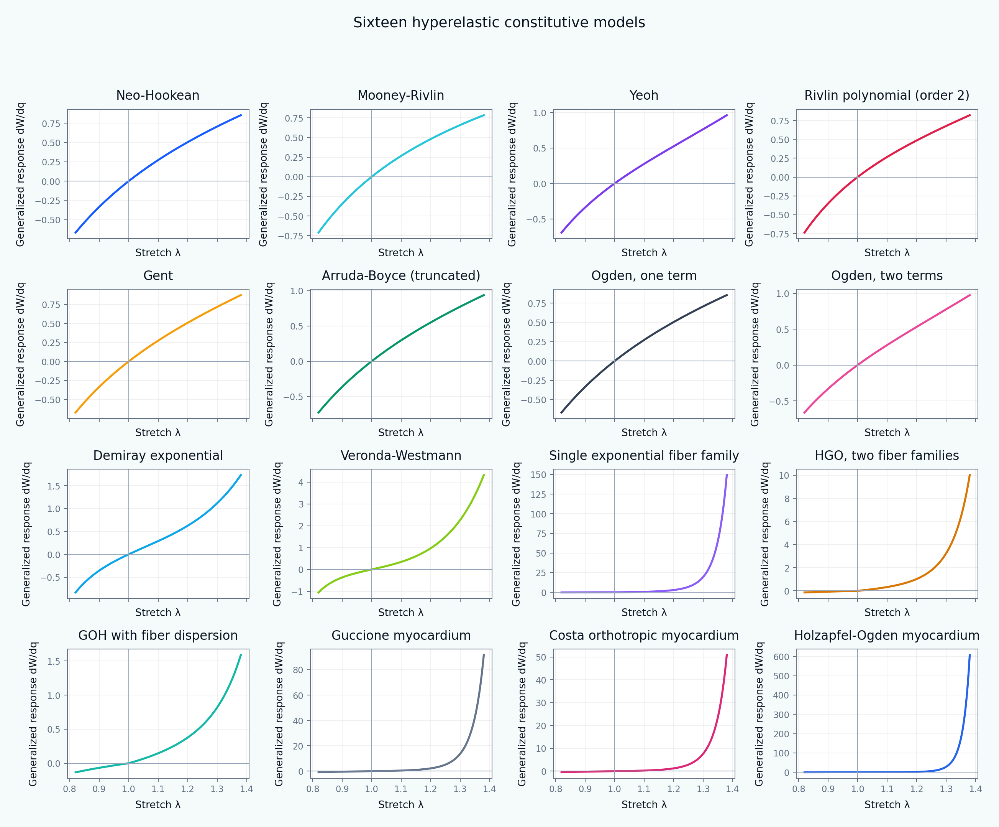

[English](README.md) | [Русский](README.ru.md)

# Tutorial 03 — Hyperelastic Constitutive Models

**Research question:** How do common isotropic, fiber-reinforced, and myocardial strain-energy functions differ when they are evaluated under the same controlled deformation paths?

This tutorial is a structured comparison of **16 hyperelastic constitutive models** and **three volumetric penalty functions**. It is designed to teach model families, invariants, loading paths, energy differentiation, numerical verification, parameter sensitivity, and the limits of calibration from a single experiment.

> All parameters and generated curves are synthetic teaching examples. They are not fitted properties of a particular tissue, patient, species, or experiment.



## Learning outcomes

After completing the tutorial, the learner can:

1. distinguish a deformation gradient, right Cauchy–Green tensor, Jacobian, isochoric invariants, and principal stretches;
2. implement and compare invariant-based and principal-stretch-based energies;
3. explain the assumptions behind Neo-Hookean, Mooney–Rivlin, Yeoh, Rivlin-polynomial, Gent, Arruda–Boyce, Ogden, Demiray, and Veronda–Westmann models;
4. construct single-family, HGO, and GOH fiber energies;
5. interpret Guccione, Costa, and Holzapfel–Ogden myocardial models in the fiber–sheet–normal basis;
6. differentiate energy numerically along a deformation path and verify the result against an analytical solution;
7. show why a good uniaxial fit does not guarantee a reliable biaxial or shear prediction;
8. discuss objectivity, incompressibility, tension-only fibers, parameter identifiability, and model selection.

## Model catalog

| Family | Models |
|---|---|
| Isotropic | Neo-Hookean; Mooney–Rivlin; Yeoh; second-order Rivlin polynomial; Gent; truncated Arruda–Boyce; one-term Ogden; two-term Ogden; Demiray; Veronda–Westmann |
| Fiber reinforced | single exponential fiber family; HGO with two symmetric families; GOH with fiber dispersion |
| Myocardium | Guccione; Costa; Holzapfel–Ogden |
| Volumetric penalties | quadratic; logarithmic; Simo–Taylor |

## Tutorial structure

- [01 Motivation](chapters/01_motivation.md)
- [02 Learning objectives](chapters/02_learning_objectives.md)
- [03 Finite-strain kinematics](chapters/03_finite_strain_kinematics.md)
- [04 Isotropic models](chapters/04_isotropic_models.md)
- [05 Fiber-reinforced models](chapters/05_fiber_models.md)
- [06 Myocardial models](chapters/06_myocardium_models.md)
- [07 Numerical method and verification](chapters/07_numerical_method.md)
- [08 Computational experiments](chapters/08_computational_experiments.md)
- [09 Interpretation and limitations](chapters/09_interpretation_limitations.md)
- [10 References and further reading](chapters/10_references.md)

## Interactive notebook

Open:

```text
notebooks/03_hyperelastic_constitutive_models.ipynb
```

The notebook calculates curves directly from the local package in `src/biomechanics_tutorials/hyperelasticity.py`. It does not read the committed PNG files.

## Reproduce every result

From the repository root:

```bash
python tutorials/03-hyperelastic-constitutive-models/reproduce.py
```

This command recreates all English/Russian PNG and GIF files from the experiment scripts.

## Main experiments

- [model catalog](figures/model_catalog.png);
- [ten isotropic laws in uniaxial loading](figures/isotropic_uniaxial.png);
- [comparison across four loading modes](figures/deformation_modes.png);
- [limiting-chain effects](figures/limiting_chain.png);
- [Ogden exponent sensitivity](figures/ogden_exponents.png);
- [calibration non-uniqueness](figures/calibration_nonuniqueness.png);
- [volumetric penalties](figures/volumetric_penalties.png);
- [fiber-angle dependence](figures/fiber_angle.png);
- [stretch–angle response map](figures/fiber_angle_map.png);
- [HGO versus GOH dispersion](figures/hgo_goh_dispersion.png);
- [myocardial shear modes](figures/myocardium_shear_modes.png);
- [energy-derivative verification](figures/derivative_verification.png);
- [objectivity check](figures/objectivity_check.png);
- [Gent limiting-chain animation](animations/gent_limiting_chain.gif).

## Exercises

- [Explore](exercises/explore.md)
- [Experiment](exercises/experiment.md)
- [Research Challenge](exercises/research_challenge.md)

## Important interpretation rule

The function plotted as response is the path derivative

\[
R(q)=\frac{dW(\mathbf F(q))}{dq}.
\]

For the incompressible uniaxial path, it is the work-conjugate nominal response. For a shear path, it is the generalized shear response. This transparent definition permits all 16 energies to be compared with one numerical procedure, but it is not a replacement for deriving the complete stress tensor required by a finite-element implementation.
