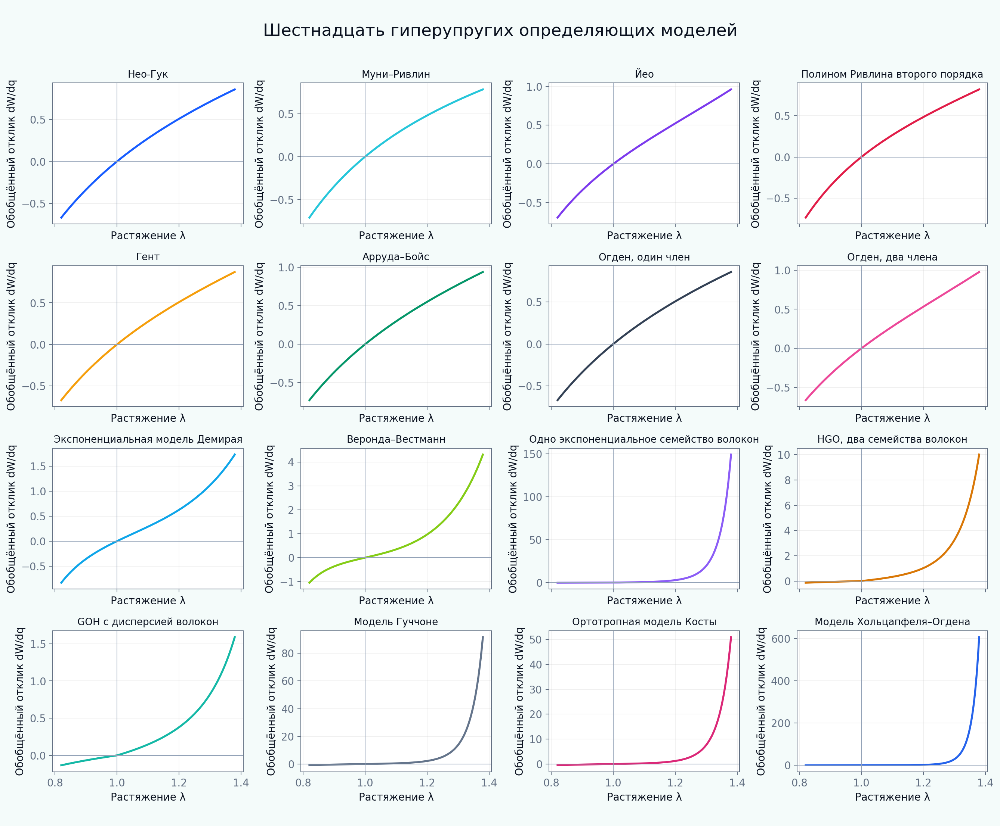

[English](README.md) | [Русский](README.ru.md)

# Tutorial 03 — Гиперупругие определяющие соотношения

**Исследовательский вопрос:** чем различаются распространённые изотропные, волокнистые и миокардиальные функции энергии, если вычислять их при одинаковых контролируемых путях деформации?

В tutorial сопоставляются **16 гиперупругих моделей** и **три варианта объёмной штрафной энергии**. Модуль последовательно вводит семейства моделей, инварианты, режимы нагружения, дифференцирование энергии, численную верификацию, чувствительность к параметрам и ограничения калибровки по одному эксперименту.

> Все параметры и кривые являются синтетическими учебными примерами. Они не представляют свойства конкретной ткани, пациента, вида животных или экспериментальной выборки.



## Результаты обучения

После прохождения tutorial обучающийся сможет:

1. различать градиент деформации, правый тензор Коши–Грина, якобиан, изохорные инварианты и главные удлинения;
2. реализовывать и сопоставлять энергии, заданные через инварианты и главные удлинения;
3. объяснять предпосылки моделей Нео-Гука, Муни–Ривлина, Йео, полинома Ривлина, Гента, Арруды–Бойса, Огдена, Демирая и Веронды–Вестманна;
4. строить энергии одиночного семейства волокон, HGO и GOH;
5. интерпретировать модели Гуччоне, Косты и Хольцапфеля–Огдена в базисе «волокно — лист — нормаль»;
6. численно дифференцировать энергию вдоль пути деформации и проверять результат по аналитическому решению;
7. показывать, почему хорошая одноосная аппроксимация не гарантирует надёжного двухосного или сдвигового прогноза;
8. обсуждать объективность, несжимаемость, включение волокон только при растяжении, идентифицируемость параметров и выбор модели.

## Каталог моделей

| Семейство | Модели |
|---|---|
| Изотропные | Нео-Гук; Муни–Ривлин; Йео; полином Ривлина второго порядка; Гент; усечённая модель Арруды–Бойса; одночленная и двухчленная модели Огдена; Демирай; Веронда–Вестманн |
| Волокнистые | одно экспоненциальное семейство; HGO с двумя симметричными семействами; GOH с дисперсией ориентаций |
| Миокард | Гуччоне; Коста; Хольцапфель–Огден |
| Объёмные энергии | квадратичная; логарифмическая; Симо–Тейлор |

## Структура tutorial

- [01 Мотивация](chapters/ru/01_motivation.md)
- [02 Результаты обучения](chapters/ru/02_learning_objectives.md)
- [03 Кинематика конечных деформаций](chapters/ru/03_finite_strain_kinematics.md)
- [04 Изотропные модели](chapters/ru/04_isotropic_models.md)
- [05 Волокнистые модели](chapters/ru/05_fiber_models.md)
- [06 Модели миокарда](chapters/ru/06_myocardium_models.md)
- [07 Численный метод и верификация](chapters/ru/07_numerical_method.md)
- [08 Вычислительные эксперименты](chapters/ru/08_computational_experiments.md)
- [09 Интерпретация и ограничения](chapters/ru/09_interpretation_limitations.md)
- [10 Литература](chapters/ru/10_references.md)

## Интерактивный notebook

Откройте:

```text
notebooks/03_hyperelastic_constitutive_models_ru.ipynb
```

Notebook вычисляет кривые из локального модуля `src/biomechanics_tutorials/hyperelasticity.py` и не считывает готовые PNG из папки `figures`.

## Воспроизведение всех результатов

Из корня репозитория:

```bash
python tutorials/03-hyperelastic-constitutive-models/reproduce.py
```

Команда заново создаёт все английские и русские PNG/GIF из сценариев в `experiments/`.

## Основные эксперименты

- [каталог моделей](figures/model_catalog_ru.png);
- [десять изотропных моделей](figures/isotropic_uniaxial_ru.png);
- [четыре режима нагружения](figures/deformation_modes_ru.png);
- [предельная растяжимость цепей](figures/limiting_chain_ru.png);
- [чувствительность к показателям Огдена](figures/ogden_exponents_ru.png);
- [неединственность калибровки](figures/calibration_nonuniqueness_ru.png);
- [объёмные энергии](figures/volumetric_penalties_ru.png);
- [влияние угла волокон](figures/fiber_angle_ru.png);
- [карта «растяжение — угол»](figures/fiber_angle_map_ru.png);
- [HGO и GOH](figures/hgo_goh_dispersion_ru.png);
- [сдвиговые режимы миокарда](figures/myocardium_shear_modes_ru.png);
- [верификация производной энергии](figures/derivative_verification_ru.png);
- [проверка объективности](figures/objectivity_check_ru.png);
- [анимация модели Гента](animations/gent_limiting_chain_ru.gif).

## Задания

- [Explore](exercises/ru/explore.md)
- [Experiment](exercises/ru/experiment.md)
- [Research Challenge](exercises/ru/research_challenge.md)

## Правило интерпретации графиков

В качестве отклика используется производная энергии вдоль заданного пути:

\[
R(q)=\frac{dW(\mathbf F(q))}{dq}.
\]

Для несжимаемого одноосного пути это энергетически сопряжённый номинальный отклик, а для пути простого сдвига — обобщённый сдвиговый отклик. Такое определение позволяет единым численным способом сравнить все 16 энергий, но не заменяет вывод полного тензора напряжений, необходимого для конечно-элементной реализации.
