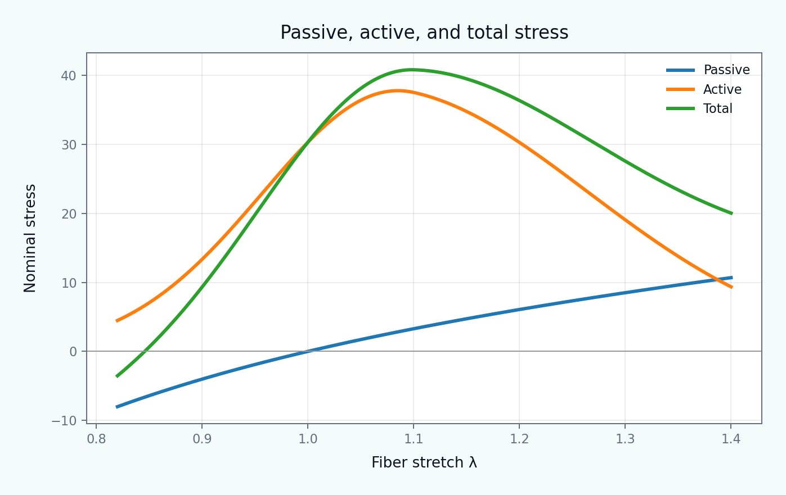

[English](README.md) | [Русский](README.ru.md)

# Tutorial 04 — Active and Passive Stress

**Research question:** How do passive tissue mechanics, active tension generation, and the chosen continuum formulation interact during contraction?

This tutorial separates four ingredients that are often mixed together: passive material response, the activation signal, length/velocity modulation, and the continuum representation of contraction. It then compares additive **active stress** with multiplicative **active strain** under matched uniaxial calibration and unmatched shear loading.

> All parameters, transients, and curves are synthetic teaching examples. They are not fitted properties of a specific tissue, patient, animal, or experiment.



## Learning outcomes

After completing the tutorial, the learner can:

1. distinguish passive stress, activation, active tension, and total stress;
2. implement normalized activation transients;
3. interpret force–length and force–velocity multipliers;
4. calculate isometric and quasi-static isotonic responses;
5. construct an active Cauchy stress and convert it to first Piola stress;
6. construct a volume-preserving active deformation gradient;
7. compare additive active stress and multiplicative active strain;
8. explain why one-point uniaxial calibration does not identify multiaxial behavior;
9. integrate a minimal calcium/cross-bridge kinetic model;
10. identify assumptions that must be revisited before research or finite-element use.

## Tutorial structure

- [01 Motivation](chapters/01_motivation.md)
- [02 Learning objectives](chapters/02_learning_objectives.md)
- [03 Passive and active mechanics](chapters/03_passive_active_mechanics.md)
- [04 Activation, force–length, and force–velocity](chapters/04_activation_relations.md)
- [05 Active stress](chapters/05_active_stress.md)
- [06 Active strain](chapters/06_active_strain.md)
- [07 Calcium and cross-bridge dynamics](chapters/07_crossbridge_dynamics.md)
- [08 Computational protocols](chapters/08_computational_protocols.md)
- [09 Interpretation and limitations](chapters/09_interpretation_limitations.md)
- [10 References](chapters/10_references.md)

## Interactive notebook

Open:

```text
notebooks/04_active_passive_stress.ipynb
```

The notebook calculates results directly from `src/biomechanics_tutorials/active_mechanics.py`. It does not read the committed PNG or GIF files.

## Reproduce every result

From the repository root:

```bash
python tutorials/04-active-passive-stress/reproduce.py
```

## Main experiments

- [activation waveforms](figures/activation_waveforms.png);
- [force–length and force–velocity relations](figures/force_length_velocity.png);
- [passive/active/total stress decomposition](figures/stress_decomposition.png);
- [preload dependence](figures/preload_dependence.png);
- [isometric twitches](figures/isometric_twitches.png);
- [isotonic afterload response](figures/isotonic_afterload.png);
- [active stress and active strain in uniaxial loading](figures/active_approaches_uniaxial.png);
- [their divergence in shear](figures/active_approaches_shear.png);
- [active-strain kinematics](figures/active_strain_kinematics.png);
- [calcium/cross-bridge dynamics](figures/calcium_crossbridge.png);
- [transverse activation sensitivity](figures/transverse_activation.png);
- [activation–stretch response map](figures/activation_stretch_map.png);
- [active-twitch animation](animations/active_twitch.gif).

## Exercises

- [Explore](exercises/explore.md)
- [Experiment](exercises/experiment.md)
- [Research Challenge](exercises/research_challenge.md)

## Central interpretation rule

A model may match another model at one uniaxial calibration point and still predict a different response under shear, biaxial loading, or changing fiber orientation. Calibration agreement is not constitutive equivalence.
