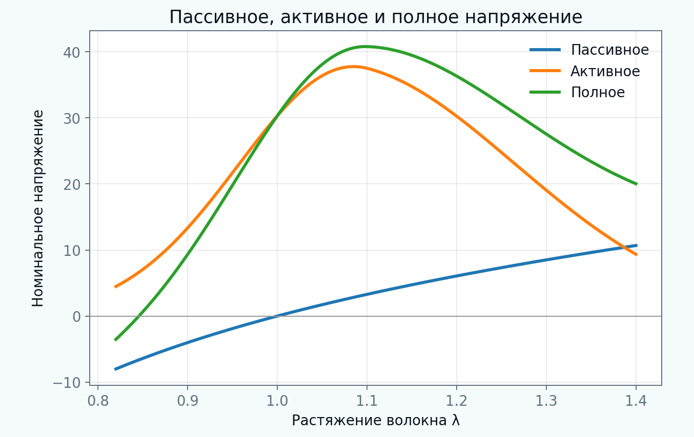

[English](README.md) | [Русский](README.ru.md)

# Туториал 04 — Активное и пассивное напряжение

**Исследовательский вопрос:** как взаимодействуют пассивная механика ткани, генерация активного усилия и выбранный континуальный способ описания сокращения?

В туториале раздельно рассматриваются четыре компонента, которые часто смешиваются: пассивный материальный отклик, сигнал активации, зависимости от длины и скорости, а также континуальное представление сокращения. Затем сравниваются аддитивное **active stress** и мультипликативное **active strain** после согласования в одной одноосной точке и при последующем сдвиговом нагружении.

> Все параметры, временные сигналы и кривые являются синтетическими учебными примерами. Они не идентифицированы для конкретной ткани, пациента, животного или эксперимента.



## Результаты обучения

После прохождения модуля обучающийся сможет:

1. различать пассивное напряжение, активацию, активное усилие и полное напряжение;
2. реализовывать нормированные временные сигналы активации;
3. интерпретировать зависимости «сила–длина» и «сила–скорость»;
4. рассчитывать изометрический и квазистатический изотонический отклик;
5. строить активное напряжение Коши и переводить его в первое напряжение Пиолы;
6. строить объёмосохраняющий активный градиент деформации;
7. сравнивать аддитивный active stress и мультипликативный active strain;
8. объяснять, почему одноточечная одноосная калибровка не определяет многоосное поведение;
9. интегрировать минимальную кальций–кросс-мостиковую модель;
10. формулировать ограничения, которые необходимо учитывать перед исследовательским или конечно-элементным применением.

## Структура туториала

- [01 Мотивация](chapters/ru/01_motivation.md)
- [02 Результаты обучения](chapters/ru/02_learning_objectives.md)
- [03 Пассивная и активная механика](chapters/ru/03_passive_active_mechanics.md)
- [04 Активация, сила–длина и сила–скорость](chapters/ru/04_activation_relations.md)
- [05 Active stress](chapters/ru/05_active_stress.md)
- [06 Active strain](chapters/ru/06_active_strain.md)
- [07 Динамика кальция и кросс-мостиков](chapters/ru/07_crossbridge_dynamics.md)
- [08 Вычислительные протоколы](chapters/ru/08_computational_protocols.md)
- [09 Интерпретация и ограничения](chapters/ru/09_interpretation_limitations.md)
- [10 Источники](chapters/ru/10_references.md)

## Интерактивный notebook

Откройте:

```text
notebooks/04_active_passive_stress_ru.ipynb
```

Notebook вычисляет результаты непосредственно через `src/biomechanics_tutorials/active_mechanics.py` и не считывает готовые PNG/GIF.

## Полное воспроизведение

Из корня репозитория:

```bash
python tutorials/04-active-passive-stress/reproduce.py
```

## Основные эксперименты

- [функции активации](figures/activation_waveforms_ru.png);
- [сила–длина и сила–скорость](figures/force_length_velocity_ru.png);
- [пассивное, активное и полное напряжение](figures/stress_decomposition_ru.png);
- [зависимость от преднагрузки](figures/preload_dependence_ru.png);
- [изометрические сокращения](figures/isometric_twitches_ru.png);
- [изотоническое укорочение](figures/isotonic_afterload_ru.png);
- [active stress и active strain в одноосном режиме](figures/active_approaches_uniaxial_ru.png);
- [расхождение подходов при сдвиге](figures/active_approaches_shear_ru.png);
- [кинематика active strain](figures/active_strain_kinematics_ru.png);
- [динамика кальция и кросс-мостиков](figures/calcium_crossbridge_ru.png);
- [чувствительность к поперечной активации](figures/transverse_activation_ru.png);
- [карта «активация–растяжение»](figures/activation_stretch_map_ru.png);
- [анимация сокращения](animations/active_twitch_ru.gif).

## Задания

- [Explore](exercises/ru/explore.md)
- [Experiment](exercises/ru/experiment.md)
- [Research Challenge](exercises/ru/research_challenge.md)

## Главное правило интерпретации

Совпадение двух моделей в одной точке одноосной калибровки не означает совпадения при сдвиге, двухосном нагружении или изменении ориентации волокон. Совпадение калибровки не равно конститутивной эквивалентности.
