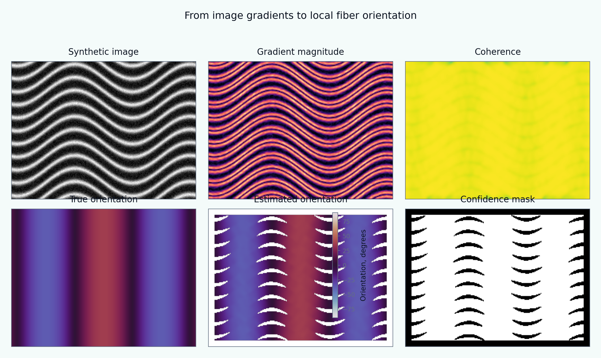

[English](README.md) | [Русский](README.ru.md)

# Tutorial 05 — Structure-Tensor Orientation Extraction

**Research question:** How can local axial fiber orientation be estimated from an image, verified against known synthetic truth, and reported with an explicit confidence measure?

This tutorial constructs synthetic fibrous images, computes the two-dimensional structure tensor, extracts the tangent orientation of bright ridges, and quantifies accuracy with axial-angle metrics. It treats smoothing scales, confidence masking, boundaries, illumination, and crossing fibers as part of the model rather than as plotting details.

> All images and benchmarks are synthetic and reproducible. They are designed for method verification and teaching, not for experimental or clinical validation.



## Learning outcomes

After completing the tutorial, the learner can:

1. distinguish image-gradient direction from fiber tangent direction;
2. construct the local structure tensor from smoothed gradient products;
3. compute its eigenvalues, orientation, energy, and coherence;
4. handle axial angles with 180-degree periodicity;
5. generate synthetic fields with known orientation truth;
6. quantify MAE, RMSE, median, P95, bias, and coverage;
7. choose gradient and integration scales for a stated objective;
8. explain the accuracy–resolution trade-off;
9. identify boundary, illumination, and low-signal artifacts;
10. explain why a single tensor cannot resolve two crossing families.

## Tutorial structure

- [01 Motivation](chapters/01_motivation.md)
- [02 Learning objectives](chapters/02_learning_objectives.md)
- [03 Synthetic fiber images](chapters/03_synthetic_images.md)
- [04 Structure-tensor formulation](chapters/04_structure_tensor.md)
- [05 Axial orientation and confidence](chapters/05_axial_statistics.md)
- [06 Numerical implementation](chapters/06_numerical_method.md)
- [07 Verification experiments](chapters/07_verification.md)
- [08 Failure modes](chapters/08_failure_modes.md)
- [09 Interpretation and limitations](chapters/09_interpretation_limitations.md)
- [10 References](chapters/10_references.md)

## Interactive notebook

Open:

```text
notebooks/05_structure_tensor_orientation.ipynb
```

The notebook calculates orientation fields directly from `src/biomechanics_tutorials/structure_tensor.py`. It does not read the committed PNG or GIF files.

## Reproduce every result

From the repository root:

```bash
python tutorials/05-structure-tensor-orientation/reproduce.py
```

## Main experiments

- [synthetic field gallery](figures/synthetic_gallery.png);
- [complete processing pipeline](figures/pipeline_steps.png);
- [known-angle verification](figures/known_angle_benchmark.png);
- [noise–scale map](figures/noise_scale_map.png);
- [coherence threshold and coverage](figures/coherence_threshold.png);
- [curved field](figures/curved_field.png);
- [piecewise orientation domains](figures/piecewise_domains.png);
- [crossing-fiber failure](figures/crossing_failure.png);
- [orientation statistics](figures/orientation_statistics.png);
- [uneven illumination](figures/illumination_robustness.png);
- [boundary artifacts](figures/boundary_artifacts.png);
- [synthetic benchmark](figures/benchmark_summary.png);
- [integration-scale animation](animations/integration_scale.gif).

## Exercises

- [Explore](exercises/explore.md)
- [Experiment](exercises/experiment.md)
- [Research Challenge](exercises/research_challenge.md)

## Central interpretation rule

A local orientation estimate is meaningful only together with the image scale, integration scale, signal energy, confidence criterion, and the assumption that one dominant direction exists inside the averaging neighborhood.
