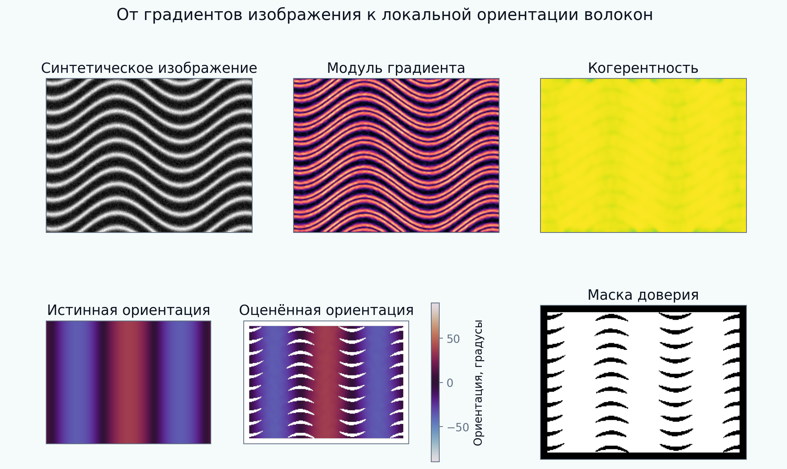

[English](README.md) | [Русский](README.ru.md)

# Tutorial 05 — Извлечение ориентации тензором структуры

**Исследовательский вопрос:** как оценить локальную осевую ориентацию волокон по изображению, проверить её по известной синтетической истине и сопроводить явной мерой доверия?

В tutorial строятся синтетические волокнистые изображения, вычисляется двумерный тензор структуры, извлекается касательное направление светлых полос и количественно оценивается точность с учётом осевой периодичности углов. Масштабы сглаживания, маска доверия, границы, неравномерное освещение и пересечение волокон рассматриваются как части метода, а не как детали визуализации.

> Все изображения и benchmark-наборы синтетические и воспроизводимые. Они предназначены для обучения и верификации метода, а не для заявления экспериментальной или клинической валидации.



## Результаты обучения

После завершения tutorial обучающийся сможет:

1. различать направление градиента изображения и касательное направление волокна;
2. строить локальный тензор структуры из сглаженных произведений градиентов;
3. вычислять собственные значения, ориентацию, энергию и когерентность;
4. работать с осевыми углами, периодичными через 180°;
5. генерировать синтетические поля с известной истинной ориентацией;
6. рассчитывать MAE, RMSE, медиану, P95, смещение и покрытие;
7. выбирать градиентный и интеграционный масштабы под конкретную цель;
8. объяснять компромисс между точностью и пространственным разрешением;
9. выявлять краевые, световые и низкосигнальные артефакты;
10. объяснять, почему один тензор не разрешает два пересекающихся семейства.

## Структура tutorial

- [01 Мотивация](chapters/ru/01_motivation.md)
- [02 Результаты обучения](chapters/ru/02_learning_objectives.md)
- [03 Синтетические волокнистые изображения](chapters/ru/03_synthetic_images.md)
- [04 Формулировка тензора структуры](chapters/ru/04_structure_tensor.md)
- [05 Осевая ориентация и доверие](chapters/ru/05_axial_statistics.md)
- [06 Численная реализация](chapters/ru/06_numerical_method.md)
- [07 Верификационные эксперименты](chapters/ru/07_verification.md)
- [08 Режимы отказа](chapters/ru/08_failure_modes.md)
- [09 Интерпретация и ограничения](chapters/ru/09_interpretation_limitations.md)
- [10 Литература](chapters/ru/10_references.md)

## Интерактивный notebook

Откройте:

```text
notebooks/05_structure_tensor_orientation_ru.ipynb
```

Notebook вычисляет поля ориентации непосредственно через `src/biomechanics_tutorials/structure_tensor.py` и не загружает сохранённые PNG/GIF.

## Воспроизведение всех результатов

Из корня репозитория:

```bash
python tutorials/05-structure-tensor-orientation/reproduce.py
```

## Основные эксперименты

- [галерея синтетических полей](figures/synthetic_gallery_ru.png);
- [полный вычислительный pipeline](figures/pipeline_steps_ru.png);
- [верификация известных углов](figures/known_angle_benchmark_ru.png);
- [карта шум–масштаб](figures/noise_scale_map_ru.png);
- [порог когерентности и покрытие](figures/coherence_threshold_ru.png);
- [криволинейное поле](figures/curved_field_ru.png);
- [две области ориентации](figures/piecewise_domains_ru.png);
- [отказ на пересекающихся волокнах](figures/crossing_failure_ru.png);
- [статистика ориентаций](figures/orientation_statistics_ru.png);
- [неравномерное освещение](figures/illumination_robustness_ru.png);
- [краевые артефакты](figures/boundary_artifacts_ru.png);
- [синтетический benchmark](figures/benchmark_summary_ru.png);
- [анимация интеграционного масштаба](animations/integration_scale_ru.gif).

## Задания

- [Explore](exercises/ru/explore.md)
- [Experiment](exercises/ru/experiment.md)
- [Research Challenge](exercises/ru/research_challenge.md)

## Центральное правило интерпретации

Локальная оценка ориентации имеет смысл только вместе с масштабом изображения, интеграционным масштабом, энергией сигнала, критерием доверия и предположением, что внутри окрестности существует одно доминирующее направление.
