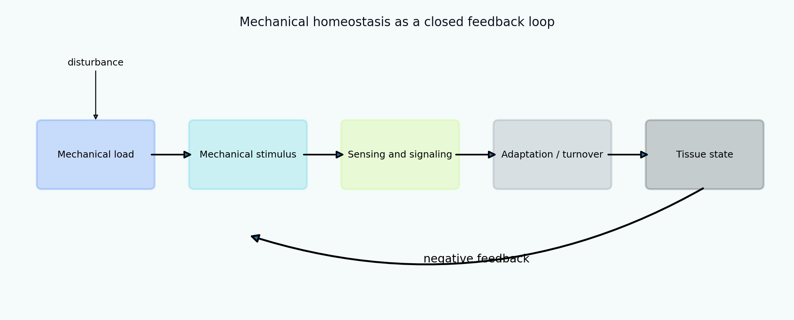

[English](README.md) | [Русский](README.ru.md)

# Tutorial 06 — Mechanical Homeostasis

**Research question:** under what conditions can a load-bearing tissue establish, maintain, or restore a preferred mechanical state, and why can the same feedback architecture instead produce residual error, oscillation, or maladaptation?

This tutorial develops mechanical homeostasis as a hierarchy of models. It begins with an analytically solvable scalar feedback law, then adds dead zones, rate limits, noisy sensing, low-pass filtering, delayed response, moving set-points, constituent turnover, and a two-stimulus vascular adaptation model. The emphasis is not merely on obtaining a return to a target, but on verifying the feedback system, quantifying recovery, and distinguishing stable regulation from mechanobiological instability.

> Every parameter, disturbance, benchmark, and trajectory in this tutorial is synthetic. The module is a verification-oriented teaching environment and does not claim experimental, animal, clinical, or patient-specific validation.



## Learning outcomes

After completing the tutorial, the learner will be able to:

1. distinguish a mechanical set-point, a homeostatic range, an observed steady state, and an attractor;
2. derive an analytically solvable stress-regulating feedback law;
3. verify numerical integration against the analytical solution;
4. quantify recovery using integral error, residual error, peak error, and settling time;
5. explain how dead zones, saturation, limits, noise, bias, filtering, and delay alter regulation;
6. identify stable, oscillatory, slow, biased, and divergent adaptation regimes;
7. distinguish constant total mass from zero constituent turnover;
8. implement constituent-specific production, removal, survival, and deposition metadata;
9. connect a reduced turnover model to constrained-mixture thinking without claiming equivalence;
10. derive an idealized vascular equilibrium that restores wall shear and circumferential stress;
11. analyse coupled radius–thickness trajectories in state space;
12. formulate synthetic verification tests and discuss structural non-identifiability.

## Tutorial structure

- [01 Motivation and definitions](chapters/01_motivation.md)
- [02 Feedback architecture and set-points](chapters/02_feedback_architecture.md)
- [03 Scalar analytical model](chapters/03_scalar_model.md)
- [04 Numerical method and recovery metrics](chapters/04_numerical_metrics.md)
- [05 Nonlinear feedback: dead zones and saturation](chapters/05_nonlinear_feedback.md)
- [06 Sensing, noise, filtering, bias, and allostasis](chapters/06_sensing_allostasis.md)
- [07 Delays and mechanobiological stability](chapters/07_stability_delay.md)
- [08 Turnover as dynamic equilibrium](chapters/08_turnover.md)
- [09 Multiple constituents and constrained-mixture bridge](chapters/09_constituents.md)
- [10 Two-stimulus vascular homeostasis](chapters/10_vascular_homeostasis.md)
- [11 Verification benchmark and identifiability](chapters/11_verification_identifiability.md)
- [12 Interpretation, limitations, and extensions](chapters/12_interpretation_limitations.md)
- [13 References](chapters/13_references.md)

## Interactive notebook

Open:

```text
notebooks/06_mechanical_homeostasis.ipynb
```

The notebook computes trajectories directly from `src/biomechanics_tutorials/mechanical_homeostasis.py`. It does not load the committed figures.

## Reproduce every result

From the repository root:

```bash
python tutorials/06-mechanical-homeostasis/reproduce.py
```

## Main experiments

- [closed feedback loop](figures/feedback_loop.png);
- [analytical verification](figures/analytical_verification.png);
- [step, pulse, ramp, and cyclic disturbances](figures/disturbance_protocols.png);
- [adaptation-rate sweep](figures/rate_sweep.png);
- [dead zones and saturation](figures/nonlinear_feedback.png);
- [noisy sensing and filtering](figures/sensing_noise.png);
- [sensor bias and a moving target](figures/bias_allostasis.png);
- [gain–delay stability map](figures/delay_stability_map.png);
- [maladaptation mechanisms](figures/maladaptation_modes.png);
- [production–removal balance](figures/turnover_balance.png);
- [constituent-specific turnover](figures/constituent_turnover.png);
- [vascular radius and thickness adaptation](figures/vessel_adaptation.png);
- [vascular state space](figures/vessel_state_space.png);
- [synthetic benchmark](figures/benchmark_summary.png);
- [homeostatic recovery animation](animations/homeostatic_recovery.gif).

## Exercises

- [Explore](exercises/explore.md)
- [Experiment](exercises/experiment.md)
- [Research Challenge](exercises/research_challenge.md)

## Central interpretation rule

A trajectory that approaches a target under one disturbance is not sufficient evidence of a robust homeostatic mechanism. Interpretation requires the target definition, feedback sign, gains, delays, sensing model, state bounds, turnover assumptions, disturbance class, and stability under parameter variation.
