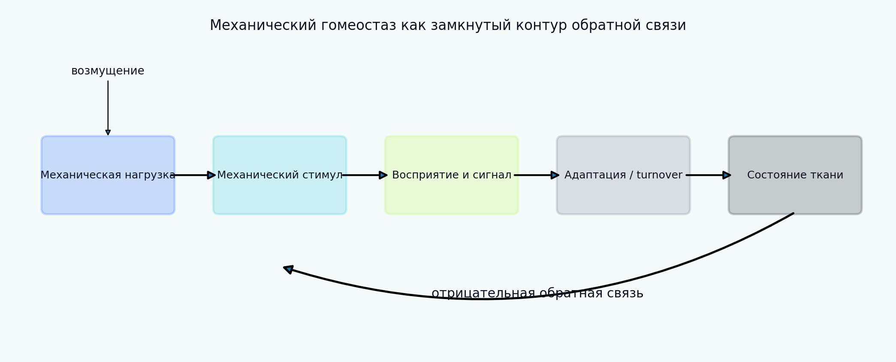

[English](README.md) | [Русский](README.ru.md)

# Tutorial 06 — Механический гомеостаз

**Исследовательский вопрос:** при каких условиях несущая нагрузку ткань способна установить, поддерживать или восстановить предпочтительное механическое состояние и почему тот же контур обратной связи может приводить к остаточной ошибке, колебаниям или дезадаптации?

Tutorial рассматривает механический гомеостаз как иерархию моделей. Сначала вводится аналитически решаемый скалярный закон обратной связи, затем последовательно добавляются мёртвая зона, ограничение скорости ответа, шум измерения, фильтрация, временная задержка, движущаяся целевая величина, оборот компонентов и сосудистая модель с двумя механическими стимулами. Цель состоит не только в получении траектории, возвращающейся к цели, но и в верификации системы регулирования, количественной оценке восстановления и различении устойчивой адаптации и механобиологической неустойчивости.

> Все параметры, возмущения, benchmark-наборы и траектории являются синтетическими. Модуль предназначен для обучения и вычислительной верификации и не заявляет экспериментальную, животную, клиническую или пациент-специфическую валидацию.



## Результаты обучения

После завершения tutorial обучающийся сможет:

1. различать механическую целевую величину, гомеостатический диапазон, наблюдаемое стационарное состояние и аттрактор;
2. вывести аналитически решаемый закон регулирования напряжения;
3. проверить численное интегрирование по аналитическому решению;
4. оценивать восстановление по интегральной, остаточной и максимальной ошибке и времени установления;
5. объяснять влияние мёртвой зоны, насыщения, физических ограничений, шума, смещения, фильтрации и задержки;
6. распознавать устойчивый, медленный, колебательный, смещённый и расходящийся режимы;
7. отличать постоянную общую массу от отсутствия turnover компонентов;
8. реализовать компонент-специфичные производство, удаление, функцию выживания и параметры отложения;
9. связать редуцированную модель turnover с constrained-mixture подходом, не объявляя их эквивалентными;
10. вывести идеализированное сосудистое равновесие для касательного и окружного напряжений;
11. анализировать совместную адаптацию радиуса и толщины в фазовом пространстве;
12. формулировать синтетические верификационные тесты и обсуждать структурную неидентифицируемость.

## Структура tutorial

- [01 Мотивация и определения](chapters/ru/01_motivation.md)
- [02 Архитектура обратной связи и целевые состояния](chapters/ru/02_feedback_architecture.md)
- [03 Скалярная аналитическая модель](chapters/ru/03_scalar_model.md)
- [04 Численный метод и метрики восстановления](chapters/ru/04_numerical_metrics.md)
- [05 Нелинейная обратная связь: мёртвая зона и насыщение](chapters/ru/05_nonlinear_feedback.md)
- [06 Восприятие, шум, фильтрация, смещение и аллостаз](chapters/ru/06_sensing_allostasis.md)
- [07 Задержка и механобиологическая устойчивость](chapters/ru/07_stability_delay.md)
- [08 Turnover как динамическое равновесие](chapters/ru/08_turnover.md)
- [09 Многокомпонентная ткань и связь с constrained mixtures](chapters/ru/09_constituents.md)
- [10 Сосудистый гомеостаз с двумя стимулами](chapters/ru/10_vascular_homeostasis.md)
- [11 Верификационный benchmark и идентифицируемость](chapters/ru/11_verification_identifiability.md)
- [12 Интерпретация, ограничения и расширения](chapters/ru/12_interpretation_limitations.md)
- [13 Литература](chapters/ru/13_references.md)

## Интерактивный notebook

Откройте:

```text
notebooks/06_mechanical_homeostasis_ru.ipynb
```

Notebook вычисляет траектории непосредственно через `src/biomechanics_tutorials/mechanical_homeostasis.py` и не загружает сохранённые изображения.

## Воспроизведение всех результатов

Из корня репозитория:

```bash
python tutorials/06-mechanical-homeostasis/reproduce.py
```

## Основные эксперименты

- [замкнутый контур обратной связи](figures/feedback_loop_ru.png);
- [аналитическая верификация](figures/analytical_verification_ru.png);
- [ступенчатое, импульсное, линейное и циклическое возмущения](figures/disturbance_protocols_ru.png);
- [исследование скорости адаптации](figures/rate_sweep_ru.png);
- [мёртвая зона и насыщение](figures/nonlinear_feedback_ru.png);
- [шумное восприятие и фильтрация](figures/sensing_noise_ru.png);
- [смещение сенсора и движущаяся цель](figures/bias_allostasis_ru.png);
- [карта устойчивости «усиление–задержка»](figures/delay_stability_map_ru.png);
- [механизмы дезадаптации](figures/maladaptation_modes_ru.png);
- [баланс производства и удаления](figures/turnover_balance_ru.png);
- [turnover отдельных компонентов](figures/constituent_turnover_ru.png);
- [адаптация радиуса и толщины сосуда](figures/vessel_adaptation_ru.png);
- [фазовое пространство сосудистой модели](figures/vessel_state_space_ru.png);
- [синтетический benchmark](figures/benchmark_summary_ru.png);
- [анимация восстановления](animations/homeostatic_recovery_ru.gif).

## Задания

- [Explore](exercises/ru/explore.md)
- [Experiment](exercises/ru/experiment.md)
- [Research Challenge](exercises/ru/research_challenge.md)

## Центральное правило интерпретации

Приближение одной траектории к цели после одного возмущения ещё не доказывает существование устойчивого гомеостатического механизма. Необходимо явно указывать определение цели, знак обратной связи, коэффициенты усиления, задержки, модель восприятия, ограничения состояния, turnover, класс возмущения и устойчивость при изменении параметров.
