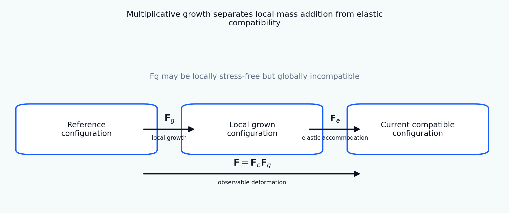

[English](README.md) | [Русский](README.ru.md)

# Tutorial 07 — Growth Tensor and Multiplicative Decomposition

**Research question:** how can finite tissue growth be represented as a local change of stress-free material state while preserving a compatible body, and what can be verified before moving to a full finite-element growth problem?

The tutorial develops the classical morphoelastic split

\[
\mathbf F=\mathbf F_e\mathbf F_g,
\]

where \(\mathbf F_g\) describes local growth or resorption and \(\mathbf F_e\) restores compatibility and carries elastic stress. The module treats this split as an internal-variable theory rather than as a visual factorization. It distinguishes free growth from constrained growth, derives determinant and stress transformations, introduces Mandel-stress-driven evolution, demonstrates noncommuting anisotropic growth paths, quantifies incompatibility of spatial growth fields, and uses a reduced differential-growth strip to connect incompatible growth with curvature and residual stress.

> All parameters, fields, trajectories, and benchmark values are synthetic teaching examples. This tutorial is verification-oriented and does not claim experimental, animal, clinical, or patient-specific validation.



## Learning outcomes

After completing the tutorial, the learner will be able to:

1. distinguish the reference, local grown, and current compatible configurations;
2. interpret \(\mathbf F_g\) as an internal local natural-state map rather than a directly observable deformation;
3. compute \(\mathbf F_e=\mathbf F\mathbf F_g^{-1}\) and verify \(J=J_eJ_g\);
4. construct isotropic, transversely isotropic, and orthotropic growth tensors;
5. compute elastic energy, Cauchy stress, first Piola stress, and Mandel stress consistently;
6. verify frame indifference and stress–energy differentiation numerically;
7. explain why free homogeneous growth may be stress-free while constrained or incompatible growth stores energy;
8. integrate a stress-driven growth law using an exponential tensor update;
9. distinguish a homeostatic target from a thermodynamically admissible evolution direction;
10. demonstrate path dependence and noncommutativity of rotated anisotropic growth increments;
11. use a row-wise curl as a pedagogical diagnostic of incompatible two-dimensional growth;
12. derive curvature and residual stress in a reduced differential-growth strip;
13. explain why the total deformation alone does not uniquely identify \(\mathbf F_e\) and \(\mathbf F_g\);
14. formulate verification tests before implementing finite growth in a finite-element solver.

## Tutorial structure

- [01 Motivation and scope](chapters/01_motivation.md)
- [02 Three configurations](chapters/02_configurations.md)
- [03 Multiplicative kinematics](chapters/03_multiplicative_kinematics.md)
- [04 Isotropic and anisotropic growth tensors](chapters/04_growth_tensors.md)
- [05 Elastic response and stress measures](chapters/05_elastic_response.md)
- [06 Free, constrained, and residual stress](chapters/06_free_constrained_growth.md)
- [07 Growth laws, Mandel stress, and dissipation](chapters/07_growth_laws.md)
- [08 Homogeneous stress-driven adaptation](chapters/08_homogeneous_adaptation.md)
- [09 Anisotropy, path dependence, and noncommutativity](chapters/09_anisotropy_paths.md)
- [10 Incompatible growth fields](chapters/10_incompatibility.md)
- [11 Differential growth and bending](chapters/11_differential_growth.md)
- [12 Verification hierarchy](chapters/12_verification.md)
- [13 Identifiability and interpretation limits](chapters/13_identifiability.md)
- [14 References](chapters/14_references.md)

## Interactive notebook

Open:

```text
notebooks/07_growth_tensor_multiplicative_decomposition.ipynb
```

The notebook computes every result from the local source package. It does not load committed figures.

## Reproduce every result

From the repository root:

```bash
python tutorials/07-growth-tensor-multiplicative-decomposition/reproduce.py
```

## Main experiments

- [multiplicative kinematics schematic](figures/kinematics_schematic.png);
- [growth-tensor atlas](figures/growth_tensor_atlas.png);
- [determinant bookkeeping](figures/determinant_bookkeeping.png);
- [free versus constrained growth](figures/free_constrained_growth.png);
- [frame-indifference check](figures/frame_indifference.png);
- [decomposition non-uniqueness](figures/decomposition_nonuniqueness.png);
- [stress-driven relaxation](figures/stress_relaxation.png);
- [growth-law parameter sweep](figures/growth_law_sweep.png);
- [isotropic versus directional growth](figures/anisotropic_growth.png);
- [noncommuting growth paths](figures/noncommutative_paths.png);
- [incompatibility map](figures/incompatibility_map.png);
- [differential-growth strip](figures/differential_growth_strip.png);
- [direction push-forward](figures/direction_pushforward.png);
- [verification benchmark](figures/benchmark_summary.png);
- [stress-relaxation animation](animations/stress_relaxation.gif).

## Exercises

- [Explore](exercises/explore.md)
- [Experiment](exercises/experiment.md)
- [Research Challenge](exercises/research_challenge.md)

## Central interpretation rule

The multiplicative split is not uniquely determined by a measured total deformation. A growth simulation becomes scientifically interpretable only when the internal state, constitutive convention, growth stimulus, evolution law, boundary constraints, incompatibility, and verification hierarchy are all stated explicitly.
