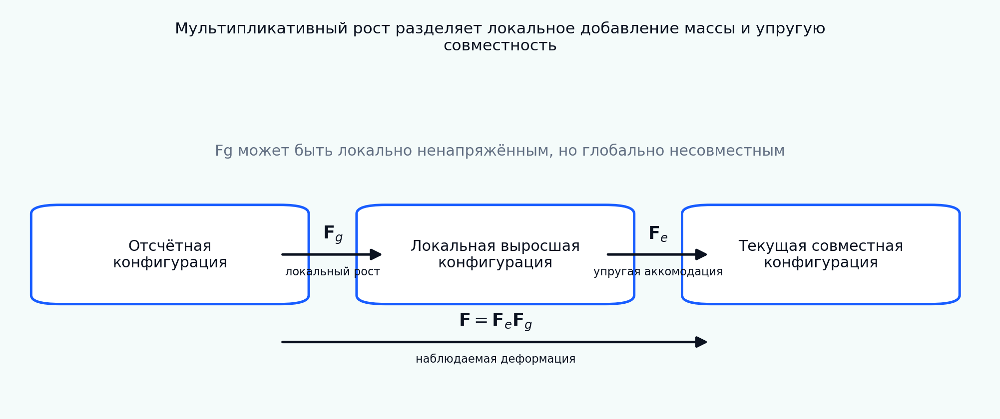

[English](README.md) | [Русский](README.ru.md)

# Tutorial 07 — Тензор роста и мультипликативное разложение

**Исследовательский вопрос:** как представить конечный рост ткани как локальное изменение ненапряжённого состояния материала, сохранив совместность целого тела, и что необходимо проверить до перехода к полноценной конечно-элементной задаче роста?

Tutorial последовательно развивает классическое морфоупругое разложение

\[
\mathbf F=\mathbf F_e\mathbf F_g,
\]

где \(\mathbf F_g\) описывает локальный рост или резорбцию, а \(\mathbf F_e\) восстанавливает совместность и несёт упругие напряжения. Разложение рассматривается как теория с внутренней переменной, а не как формальная факторизация матрицы. В модуле различаются свободный и стеснённый рост, выводятся соотношения для определителей, энергии и напряжений, вводится эволюция по напряжению Манделя, демонстрируются некоммутирующие анизотропные пути, оценивается несовместность пространственных полей роста и исследуется изгиб полосы при дифференциальном росте.

> Все параметры, поля, траектории и benchmark-значения являются синтетическими учебными примерами. Tutorial ориентирован на верификацию и не заявляет экспериментальную, животную, клиническую или пациент-специфическую валидацию.



## Результаты обучения

После завершения tutorial обучающийся сможет:

1. различать отсчётную, локальную выросшую и текущую совместную конфигурации;
2. интерпретировать \(\mathbf F_g\) как внутреннее отображение локального естественного состояния, а не как непосредственно наблюдаемую деформацию;
3. вычислять \(\mathbf F_e=\mathbf F\mathbf F_g^{-1}\) и проверять \(J=J_eJ_g\);
4. строить изотропные, трансверсально-изотропные и ортотропные тензоры роста;
5. согласованно вычислять упругую энергию, напряжение Коши, первое напряжение Пиолы и напряжение Манделя;
6. численно проверять frame indifference и связь напряжения с производной энергии;
7. объяснять, почему свободный однородный рост может быть ненапряжённым, а стеснённый или несовместный рост накапливает энергию;
8. интегрировать закон роста, управляемый напряжением, экспоненциальным тензорным обновлением;
9. отличать гомеостатическую цель от термодинамически допустимого направления эволюции;
10. демонстрировать зависимость от пути и некоммутативность повёрнутых анизотропных приращений роста;
11. использовать построчный ротор как учебный диагностический показатель двумерной несовместности;
12. выводить кривизну и остаточные напряжения в редуцированной полосе с дифференциальным ростом;
13. объяснять, почему полная деформация не определяет однозначно \(\mathbf F_e\) и \(\mathbf F_g\);
14. формулировать верификационные тесты перед реализацией конечного роста в МКЭ.

## Структура tutorial

- [01 Мотивация и область применимости](chapters/ru/01_motivation.md)
- [02 Три конфигурации](chapters/ru/02_configurations.md)
- [03 Мультипликативная кинематика](chapters/ru/03_multiplicative_kinematics.md)
- [04 Изотропные и анизотропные тензоры роста](chapters/ru/04_growth_tensors.md)
- [05 Упругий отклик и меры напряжений](chapters/ru/05_elastic_response.md)
- [06 Свободный, стеснённый рост и остаточные напряжения](chapters/ru/06_free_constrained_growth.md)
- [07 Законы роста, напряжение Манделя и диссипация](chapters/ru/07_growth_laws.md)
- [08 Однородная адаптация, управляемая напряжением](chapters/ru/08_homogeneous_adaptation.md)
- [09 Анизотропия, зависимость от пути и некоммутативность](chapters/ru/09_anisotropy_paths.md)
- [10 Несовместные поля роста](chapters/ru/10_incompatibility.md)
- [11 Дифференциальный рост и изгиб](chapters/ru/11_differential_growth.md)
- [12 Иерархия верификации](chapters/ru/12_verification.md)
- [13 Идентифицируемость и ограничения интерпретации](chapters/ru/13_identifiability.md)
- [14 Литература](chapters/ru/14_references.md)

## Интерактивный notebook

Откройте:

```text
notebooks/07_growth_tensor_multiplicative_decomposition_ru.ipynb
```

Notebook вычисляет результаты непосредственно через локальный пакет и не загружает сохранённые изображения.

## Воспроизведение всех результатов

Из корня репозитория:

```bash
python tutorials/07-growth-tensor-multiplicative-decomposition/reproduce.py
```

## Основные эксперименты

- [схема мультипликативной кинематики](figures/kinematics_schematic_ru.png);
- [атлас тензоров роста](figures/growth_tensor_atlas_ru.png);
- [баланс определителей](figures/determinant_bookkeeping_ru.png);
- [свободный и стеснённый рост](figures/free_constrained_growth_ru.png);
- [проверка frame indifference](figures/frame_indifference_ru.png);
- [неединственность разложения](figures/decomposition_nonuniqueness_ru.png);
- [релаксация при росте, управляемом напряжением](figures/stress_relaxation_ru.png);
- [исследование параметров закона роста](figures/growth_law_sweep_ru.png);
- [изотропный и направленный рост](figures/anisotropic_growth_ru.png);
- [некоммутирующие пути роста](figures/noncommutative_paths_ru.png);
- [карта несовместности](figures/incompatibility_map_ru.png);
- [полоса с дифференциальным ростом](figures/differential_growth_strip_ru.png);
- [перенос материального направления](figures/direction_pushforward_ru.png);
- [верификационный benchmark](figures/benchmark_summary_ru.png);
- [анимация релаксации](animations/stress_relaxation_ru.gif).

## Задания

- [Explore](exercises/explore.md)
- [Experiment](exercises/experiment.md)
- [Research Challenge](exercises/research_challenge.md)

## Главное правило интерпретации

Мультипликативное разложение не определяется однозначно по измеренной полной деформации. Модель роста становится научно интерпретируемой только при явном задании внутреннего состояния, энергетической конвенции, механического стимула, закона эволюции, ограничений, несовместности и иерархии верификации.
