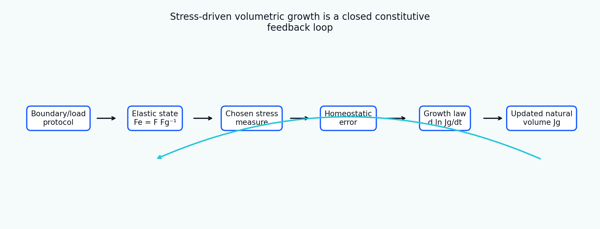

[English](README.md) | [Русский](README.ru.md)

# Tutorial 08 — Stress-Driven Volumetric Growth

**Research question:** under which assumptions can a scalar stress signal drive finite volumetric growth, and how can we distinguish a physically meaningful adaptation law from a numerically stable but scientifically ambiguous feedback rule?

The tutorial specializes the multiplicative decomposition to

\[
\mathbf F=\mathbf F_e\mathbf F_g,
\qquad
\mathbf F_g=J_g^{1/3}\mathbf I,
\]

and evolves the positive growth volume ratio through

\[
\frac{d\ln J_g}{dt}=k\,\mathcal R\left(\frac{S-S_h}{S_{scale}}\right).
\]

Unlike a minimal demonstration, the module compares stress measures, sign conventions, homeostatic bands, growth/resorption asymmetry, displacement and stress control, hydrostatic and deviatoric states, mass-density assumptions, positivity-preserving integration, local stability, spatial regularization and parameter identifiability.

> All parameters, load histories, spatial fields and benchmark values are synthetic teaching examples. This is a verification-oriented module and does not claim tissue-specific, experimental, animal, clinical or patient-specific validation.



## Learning outcomes

After completing the tutorial, the learner will be able to:

1. construct an isotropic growth tensor from a positive volume ratio;
2. distinguish mean Cauchy stress, pressure, Mandel stress, von Mises stress, principal stress and energy stimuli;
3. state tension/pressure sign conventions without ambiguity;
4. define a scalar target, homeostatic band and multidimensional homeostatic surface;
5. implement dead zones, saturation, asymmetric growth/resorption and bounds;
6. explain why displacement control can relax stress while ideal stress control cannot;
7. show that isotropic growth can remove hydrostatic stress while leaving deviatoric stress;
8. separate natural-volume growth from mass addition and density change;
9. use exponential integration to preserve positivity of \(J_g\);
10. analyse continuous and discrete closed-loop stability;
11. introduce a transparent length scale through spatial regularization;
12. diagnose compensation between growth rate and homeostatic target;
13. design a verification hierarchy before finite-element implementation.

## Tutorial structure

- [Motivation Scope](chapters/01_motivation_scope.md)
- [Kinematics State Variable](chapters/02_kinematics_state_variable.md)
- [Stress Measures Signs](chapters/03_stress_measures_signs.md)
- [Homeostatic Surface](chapters/04_homeostatic_surface.md)
- [Constitutive Growth Law](chapters/05_constitutive_growth_law.md)
- [Boundary Control](chapters/06_boundary_control.md)
- [Loading History](chapters/07_loading_history.md)
- [Hydrostatic Deviatoric](chapters/08_hydrostatic_deviatoric.md)
- [Mass Volume Density](chapters/09_mass_volume_density.md)
- [Thermodynamic Interpretation](chapters/10_thermodynamic_interpretation.md)
- [Numerical Integration](chapters/11_numerical_integration.md)
- [Stability Linearization](chapters/12_stability_linearization.md)
- [Spatial Heterogeneity](chapters/13_spatial_heterogeneity.md)
- [Parameter Identifiability](chapters/14_parameter_identifiability.md)
- [Verification Hierarchy](chapters/15_verification_hierarchy.md)
- [Limitations References](chapters/16_limitations_references.md)

## Interactive notebook

```text
notebooks/08_stress_driven_volumetric_growth.ipynb
```

## Reproduce every result

```bash
python tutorials/08-stress-driven-volumetric-growth/reproduce.py
```

## Main results

- [feedback architecture](figures/feedback_architecture.png);
- [stress-measure comparison](figures/stimulus_measures.png);
- [homeostatic surface](figures/homeostatic_surface.png);
- [fixed-deformation relaxation](figures/fixed_deformation_relaxation.png);
- [boundary-control comparison](figures/boundary_control.png);
- [loading-history comparison](figures/load_protocols.png);
- [growth and resorption asymmetry](figures/growth_resorption.png);
- [dead-zone and saturation laws](figures/dead_zone_saturation.png);
- [hydrostatic versus deviatoric response](figures/hydrostatic_deviatoric.png);
- [mass-volume-density bookkeeping](figures/mass_density.png);
- [time-integration comparison](figures/time_integration.png);
- [gain–time-step stability map](figures/gain_stability.png);
- [spatial heterogeneity](figures/spatial_heterogeneity.png);
- [regularization trade-off](figures/regularization.png);
- [parameter-identifiability map](figures/identifiability.png);
- [verification benchmark](figures/benchmark_summary.png);
- [relaxation animation](animations/volumetric_relaxation.gif).

## Central interpretation rule

A scalar homeostatic error can be driven to zero while the full stress tensor remains non-homeostatic. The stimulus measure, boundary control, mass-density convention and admissible growth mechanisms must therefore be stated together with every result.
