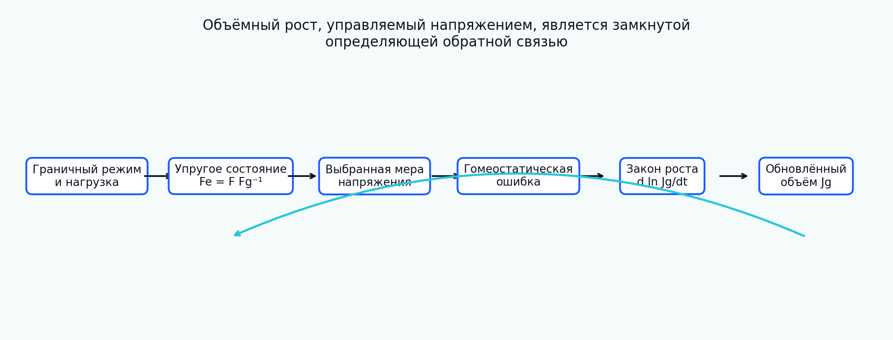

[English](README.md) | [Русский](README.ru.md)

# Tutorial 08 — Объёмный рост, управляемый напряжением

**Исследовательский вопрос:** при каких предположениях скалярный механический сигнал может управлять конечным объёмным ростом и как отличить содержательный закон адаптации от численно устойчивой, но научно неоднозначной обратной связи?

В tutorial мультипликативное разложение специализируется в виде

\[
\mathbf F=\mathbf F_e\mathbf F_g,
\qquad
\mathbf F_g=J_g^{1/3}\mathbf I,
\]

а положительный объёмный коэффициент развивается по закону

\[
\frac{d\ln J_g}{dt}=k\,\mathcal R\left(\frac{S-S_h}{S_{scale}}\right).
\]

Модуль сравнивает меры напряжения, соглашения о знаках, гомеостатические диапазоны, асимметрию роста и резорбции, управление перемещением и напряжением, гидростатические и девиаторные состояния, предположения о массе и плотности, положительное численное интегрирование, локальную устойчивость, пространственную регуляризацию и идентифицируемость параметров.

> Все параметры, истории нагружения, пространственные поля и benchmark-значения являются синтетическими учебными примерами. Модуль ориентирован на верификацию и не заявляет тканеспецифичную, экспериментальную, животную, клиническую или персонализированную валидацию.



## Результаты обучения

После tutorial обучающийся сможет:

1. строить изотропный тензор роста по положительному объёмному коэффициенту;
2. различать среднее напряжение Коши, давление, напряжение Манделя, Мизеса, главное напряжение и энергию;
3. однозначно фиксировать знаки растяжения и давления;
4. задавать скалярную цель, гомеостатический диапазон и поверхность;
5. реализовывать мёртвую зону, насыщение, асимметрию роста/резорбции и ограничения;
6. объяснять, почему управление перемещением релаксирует напряжение, а идеальное управление напряжением — нет;
7. показывать сохранение девиаторного напряжения при изотропном росте;
8. разделять естественный объём, массу и плотность;
9. сохранять положительность \(J_g\) экспоненциальной схемой;
10. анализировать непрерывную и дискретную устойчивость;
11. вводить характерную длину через прозрачную регуляризацию;
12. диагностировать компенсацию скорости роста и гомеостатической цели;
13. строить иерархию верификации до конечно-элементной реализации.

## Структура

- [Motivation Scope](chapters/ru/01_motivation_scope.md)
- [Kinematics State Variable](chapters/ru/02_kinematics_state_variable.md)
- [Stress Measures Signs](chapters/ru/03_stress_measures_signs.md)
- [Homeostatic Surface](chapters/ru/04_homeostatic_surface.md)
- [Constitutive Growth Law](chapters/ru/05_constitutive_growth_law.md)
- [Boundary Control](chapters/ru/06_boundary_control.md)
- [Loading History](chapters/ru/07_loading_history.md)
- [Hydrostatic Deviatoric](chapters/ru/08_hydrostatic_deviatoric.md)
- [Mass Volume Density](chapters/ru/09_mass_volume_density.md)
- [Thermodynamic Interpretation](chapters/ru/10_thermodynamic_interpretation.md)
- [Numerical Integration](chapters/ru/11_numerical_integration.md)
- [Stability Linearization](chapters/ru/12_stability_linearization.md)
- [Spatial Heterogeneity](chapters/ru/13_spatial_heterogeneity.md)
- [Parameter Identifiability](chapters/ru/14_parameter_identifiability.md)
- [Verification Hierarchy](chapters/ru/15_verification_hierarchy.md)
- [Limitations References](chapters/ru/16_limitations_references.md)

## Интерактивный notebook

```text
notebooks/08_stress_driven_volumetric_growth_ru.ipynb
```

## Полное воспроизведение

```bash
python tutorials/08-stress-driven-volumetric-growth/reproduce.py
```

## Основные результаты

- [архитектура обратной связи](figures/feedback_architecture_ru.png);
- [сравнение мер стимула](figures/stimulus_measures_ru.png);
- [гомеостатическая поверхность](figures/homeostatic_surface_ru.png);
- [релаксация при фиксированной деформации](figures/fixed_deformation_relaxation_ru.png);
- [сравнение граничного управления](figures/boundary_control_ru.png);
- [истории нагружения](figures/load_protocols_ru.png);
- [асимметрия роста и резорбции](figures/growth_resorption_ru.png);
- [мёртвая зона и насыщение](figures/dead_zone_saturation_ru.png);
- [гидростатический и девиаторный отклик](figures/hydrostatic_deviatoric_ru.png);
- [баланс массы, объёма и плотности](figures/mass_density_ru.png);
- [сравнение схем интегрирования](figures/time_integration_ru.png);
- [карта устойчивости](figures/gain_stability_ru.png);
- [пространственная неоднородность](figures/spatial_heterogeneity_ru.png);
- [компромисс регуляризации](figures/regularization_ru.png);
- [карта идентифицируемости](figures/identifiability_ru.png);
- [verification benchmark](figures/benchmark_summary_ru.png);
- [анимация релаксации](animations/volumetric_relaxation_ru.gif).

## Центральное правило интерпретации

Скалярную гомеостатическую ошибку можно свести к нулю, сохранив негомеостатическое полное тензорное состояние. Поэтому вместе с каждым результатом необходимо указывать меру стимула, граничное управление, соглашение о массе и плотности и допустимые механизмы роста.
