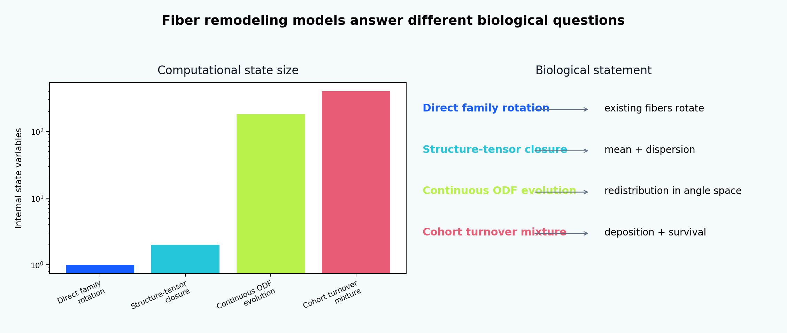

[English](README.md) | [Русский](README.ru.md)

# Tutorial 09 — Fiber-Family Remodeling

**Research question:** how should a computational model distinguish rotation of existing fibers, redistribution of an orientation distribution, collagen recruitment, and constituent turnover, and which observations are required to identify these mechanisms?

This tutorial compares four modeling levels:

1. direct rotation of discrete fiber families;
2. generalized-structure-tensor closures inspired by Holzapfel–Gasser–Ogden models;
3. Lanir-style angular integration and continuous orientation-distribution evolution;
4. cohort-based turnover inspired by constrained-mixture theory.

> All parameters, time scales, loading protocols, images, and benchmark values are synthetic teaching examples. The module is verification-oriented and does not claim tissue-specific, animal, clinical, or patient-specific validation.



## Why this topic needs more than one angle

A measured change in collagen architecture may arise from:

- rotation or sliding of existing fibers;
- deposition of new fibers in a preferred direction;
- selective survival and degradation;
- changing mass fractions of competing families;
- changing angular dispersion;
- changing crimp and recruitment stretch;
- changing cross-link state or deposition prestretch.

These mechanisms can generate similar endpoint orientation maps but different hidden states, residual stresses, time histories, and predictions under a new loading mode.

## Learning outcomes

After completing the tutorial, the learner will be able to:

1. use axial rather than directional statistics for fiber orientations;
2. implement and diagnose direct first-order family reorientation;
3. explain non-uniqueness of principal-direction cues near repeated eigenvalues;
4. evolve a normalized, non-negative axial orientation density;
5. compare alignment and rotational diffusion;
6. integrate a Lanir-type structural energy over fiber directions;
7. compare angular integration with discrete families and a planar GOH-style closure;
8. explain the role of two symmetric families in HGO-type models;
9. distinguish orientation dispersion from multimodality;
10. model crimp through a recruitment-stretch distribution;
11. track collagen cohorts with production, deposition, survival, and age;
12. explain why direct rotation is not equivalent to turnover;
13. represent deposition stretch and prestress separately from visible orientation;
14. simulate competition between differently loaded families;
15. connect continuum internal variables to plausible biological mechanisms;
16. diagnose non-identifiability from a single uniaxial test;
17. design a verification hierarchy before finite-element coupling.

## Scientific comparison

| Approach | State | Biological statement | Strength | Main limitation |
|---|---|---|---|---|
| Direct reorientation | one angle per family | existing architecture rotates | simple and efficient | no production/removal history |
| Structure-tensor closure | mean direction + dispersion | low-order moments summarize architecture | efficient constitutive model | cannot represent arbitrary multimodality |
| Continuous ODF | density over angle space | architecture redistributes continuously | expressive and image-compatible | larger state and angular PDE |
| Cohort turnover | birth mass, survival, direction, prestretch | old material is replaced by newly deposited material | biologically interpretable history | hereditary state and parameter burden |

## Tutorial structure

1. [Scope and terminology](chapters/01_scope_and_terminology.md)
2. [Biological hierarchy](chapters/02_biological_hierarchy.md)
3. [Mechanics of fiber families](chapters/03_mechanics_of_fiber_families.md)
4. [Axial statistics](chapters/04_axial_statistics.md)
5. [Direct reorientation](chapters/05_direct_reorientation.md)
6. [Cue selection and degeneracy](chapters/06_cue_selection_and_degeneracy.md)
7. [Lanir structural integration](chapters/07_lanir_structural_integration.md)
8. [Holzapfel–Gasser–Ogden approaches](chapters/08_holzapfel_goh_models.md)
9. [Continuous ODF evolution](chapters/09_continuous_odf_evolution.md)
10. [Recruitment, crimp, and cross-links](chapters/10_recruitment_crimp_crosslinks.md)
11. [Turnover, deposition, and survival](chapters/11_turnover_deposition_survival.md)
12. [Constrained-mixture interpretation](chapters/12_constrained_mixture_humphrey.md)
13. [Taber's growth-and-remodeling perspective](chapters/13_taber_growth_remodeling.md)
14. [Loading history and boundary conditions](chapters/14_loading_history_boundary_conditions.md)
15. [Mechanobiology and cellular links](chapters/15_mechanobiology_cellular_links.md)
16. [Identifiability and observables](chapters/16_identifiability_observables.md)
17. [Verification hierarchy](chapters/17_verification_hierarchy.md)
18. [Limitations and research directions](chapters/18_limitations_research_directions.md)

## Interactive notebook

```text
notebooks/09_fiber_family_remodeling.ipynb
```

## Reproduce every result

```bash
python tutorials/09-fiber-family-remodeling/reproduce.py
```

## Main results

- [modeling taxonomy](figures/modeling_taxonomy.png);
- [direct reorientation](figures/discrete_reorientation.png);
- [principal-cue degeneracy](figures/cue_degeneracy.png);
- [loading-history switch](figures/loading_switch.png);
- [continuous ODF evolution](figures/odf_evolution.png);
- [alignment–diffusion map](figures/alignment_diffusion_map.png);
- [dispersion metrics](figures/dispersion_metrics.png);
- [discrete-to-continuous convergence](figures/discrete_continuous.png);
- [Lanir integration versus structure-tensor closure](figures/lanir_goh_comparison.png);
- [two-family directional response](figures/two_family_response.png);
- [recruitment and crimp](figures/recruitment_crimp.png);
- [cohort turnover](figures/turnover_replacement.png);
- [direct rotation versus turnover](figures/direct_vs_turnover.png);
- [deposition stretch](figures/deposition_stretch.png);
- [family competition](figures/family_competition.png);
- [parameter identifiability](figures/identifiability.png);
- [biology-to-model map](figures/biology_model_map.png);
- [verification benchmark](figures/benchmark_summary.png);
- [ODF remodeling animation](animations/odf_remodeling.gif).

## Evidence map

- Taber (1995, 1998): growth/remodeling concepts and distinct mechanical stimuli;
- Lanir (1983): structural angular integration of fibrous tissues;
- Holzapfel, Gasser, and Ogden (2000): discrete arterial fiber families;
- Gasser, Ogden, and Holzapfel (2006): distributed orientations and generalized structure tensor;
- Kuhl et al. (2005): mechanically induced direct reorientation;
- Driessen et al. (2003, 2008): collagen architecture remodeling and angular distributions;
- Hariton et al. (2007): stress-driven arterial fiber remodeling;
- Humphrey and Rajagopal (2002): constrained-mixture production, removal, and natural configurations.

The full bibliography is in [references.bib](references.bib).

## Central interpretation rule

A similar final mean orientation does not imply a similar biological history. Direct rotation, angular redistribution, and cohort replacement must not be treated as interchangeable unless the data and research question justify that reduction.
