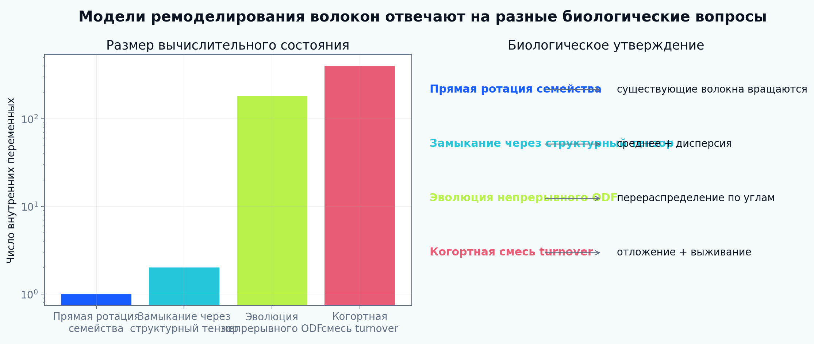

[English](README.md) | [Русский](README.ru.md)

# Tutorial 09 — Ремоделирование семейств волокон

**Исследовательский вопрос:** как в вычислительной модели различить поворот существующих волокон, перераспределение ориентационной плотности, рекрутирование коллагена и turnover компонентов и какие наблюдения нужны для идентификации этих механизмов?

Tutorial сопоставляет четыре уровня:

1. прямую ротацию дискретных семейств;
2. замыкания через структурный тензор в логике моделей Хольцапфеля–Гассера–Огдена;
3. угловое интегрирование по Ланиру и эволюцию непрерывного распределения;
4. когортный turnover в логике constrained-mixture теории.

> Все параметры, временные масштабы, протоколы, изображения и benchmark-значения являются синтетическими учебными примерами. Модуль предназначен для верификации и не заявляет тканеспецифическую, экспериментальную, клиническую или пациент-специфическую валидацию.



## Почему одного угла недостаточно

Наблюдаемая перестройка коллагена может быть следствием:

- поворота или скольжения существующих волокон;
- отложения новых волокон в выбранном направлении;
- селективного выживания и деградации;
- перераспределения массы между семействами;
- изменения угловой дисперсии;
- изменения извитости и растяжения рекрутирования;
- изменения сшивок и растяжения отложения.

Эти механизмы могут давать сходную конечную карту ориентации, но разные скрытые состояния, остаточные напряжения, временные траектории и прогнозы при новом нагружении.

## Результаты обучения

После прохождения tutorial обучающийся сможет:

1. применять осевую статистику с периодом 180°;
2. реализовать прямую переориентацию семейства;
3. диагностировать неединственность главного направления;
4. эволюционировать нормированное неотрицательное распределение ориентаций;
5. сравнивать выравнивание и вращательную диффузию;
6. вычислять структурную энергию по Ланиру;
7. сравнивать угловое интегрирование, дискретные семейства и плоское GOH-замыкание;
8. анализировать два симметричных семейства HGO-типа;
9. отличать дисперсию от многомодальности;
10. моделировать извитость через распределение слабин;
11. отслеживать когорты с синтезом, отложением, выживанием и возрастом;
12. объяснять различие прямой ротации и turnover;
13. отделять растяжение отложения и преднапряжение от видимой ориентации;
14. моделировать конкуренцию семейств;
15. связывать внутренние переменные с биологическими механизмами;
16. выявлять неидентифицируемость по одному одноосному тесту;
17. строить иерархию верификации до связи с МКЭ.

## Сравнение подходов

| Подход | Состояние | Биологическое утверждение | Сильная сторона | Ограничение |
|---|---|---|---|---|
| Прямая ротация | один угол на семейство | существующая архитектура вращается | простота | нет истории синтеза и удаления |
| Структурный тензор | среднее направление + дисперсия | архитектура описывается низшими моментами | эффективность | не описывает произвольную многомодальность |
| Непрерывный ODF | плотность в угловом пространстве | архитектура перераспределяется непрерывно | выразительность и связь с изображениями | большой размер состояния |
| Когортный turnover | масса рождения, выживание, направление, предрастяжение | старый материал замещается новым | биологическая история | наследственность и большое число параметров |

## Структура tutorial

1. [Область применения и терминология](chapters/ru/01_scope_and_terminology.md)
2. [Биологическая иерархия](chapters/ru/02_biological_hierarchy.md)
3. [Механика семейств волокон](chapters/ru/03_mechanics_of_fiber_families.md)
4. [Осевая статистика](chapters/ru/04_axial_statistics.md)
5. [Прямая переориентация](chapters/ru/05_direct_reorientation.md)
6. [Выбор стимула и вырождение](chapters/ru/06_cue_selection_and_degeneracy.md)
7. [Структурное интегрирование по Ланиру](chapters/ru/07_lanir_structural_integration.md)
8. [Подходы Хольцапфеля–Гассера–Огдена](chapters/ru/08_holzapfel_goh_models.md)
9. [Эволюция непрерывного ODF](chapters/ru/09_continuous_odf_evolution.md)
10. [Рекрутирование, извитость и сшивки](chapters/ru/10_recruitment_crimp_crosslinks.md)
11. [Turnover, отложение и выживание](chapters/ru/11_turnover_deposition_survival.md)
12. [Интерпретация constrained mixture](chapters/ru/12_constrained_mixture_humphrey.md)
13. [Перспектива Табера](chapters/ru/13_taber_growth_remodeling.md)
14. [История нагружения и граничные условия](chapters/ru/14_loading_history_boundary_conditions.md)
15. [Механобиология и клеточные связи](chapters/ru/15_mechanobiology_cellular_links.md)
16. [Идентифицируемость и наблюдаемые величины](chapters/ru/16_identifiability_observables.md)
17. [Иерархия верификации](chapters/ru/17_verification_hierarchy.md)
18. [Ограничения и развитие](chapters/ru/18_limitations_research_directions.md)

## Интерактивный notebook

```text
notebooks/09_fiber_family_remodeling_ru.ipynb
```

## Полное воспроизведение

```bash
python tutorials/09-fiber-family-remodeling/reproduce.py
```

## Основные результаты

- [таксономия моделей](figures/modeling_taxonomy_ru.png);
- [прямая переориентация](figures/discrete_reorientation_ru.png);
- [вырождение главного направления](figures/cue_degeneracy_ru.png);
- [смена истории нагружения](figures/loading_switch_ru.png);
- [эволюция непрерывного ODF](figures/odf_evolution_ru.png);
- [карта «выравнивание — диффузия»](figures/alignment_diffusion_map_ru.png);
- [метрики дисперсии](figures/dispersion_metrics_ru.png);
- [сходимость дискретной аппроксимации](figures/discrete_continuous_ru.png);
- [сравнение Ланира и структурного замыкания](figures/lanir_goh_comparison_ru.png);
- [отклик двух семейств](figures/two_family_response_ru.png);
- [рекрутирование и извитость](figures/recruitment_crimp_ru.png);
- [когортный turnover](figures/turnover_replacement_ru.png);
- [прямая ротация и замещение](figures/direct_vs_turnover_ru.png);
- [растяжение отложения](figures/deposition_stretch_ru.png);
- [конкуренция семейств](figures/family_competition_ru.png);
- [идентифицируемость](figures/identifiability_ru.png);
- [карта «биология — модель»](figures/biology_model_map_ru.png);
- [benchmark верификации](figures/benchmark_summary_ru.png);
- [GIF эволюции ODF](animations/odf_remodeling_ru.gif).

## Научные опоры

- Табер (1995, 1998): концепции роста и ремоделирования и разделение механических стимулов;
- Ланир (1983): структурное угловое интегрирование;
- Хольцапфель, Гассер и Огден (2000): дискретные семейства артериальной стенки;
- Гассер, Огден и Хольцапфель (2006): распределённые ориентации;
- Куль и соавторы (2005): механически индуцированная прямая переориентация;
- Дриссен и соавторы (2003, 2008): ремоделирование коллагеновой архитектуры и углового распределения;
- Харитон и соавторы (2007): стресс-зависимое ремоделирование артериальных волокон;
- Хамфри и Раджагопал (2002): constrained mixture, производство, удаление и естественные конфигурации.

Полная библиография: [references.bib](references.bib).

## Центральное правило интерпретации

Сходная конечная средняя ориентация не означает сходную биологическую историю. Прямую ротацию, угловое перераспределение и когортное замещение нельзя считать взаимозаменяемыми без соответствующих данных и обоснования.
