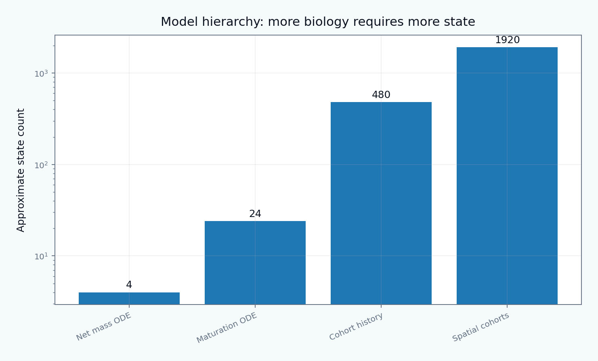

[English](README.md) | [Русский](README.ru.md)

# Tutorial 10 — Extracellular-Matrix Turnover

**Research question:** how can a computational model connect matrix production, degradation, maturation, age structure, cross-linking, deposition prestretch, inflammation, and mechanical function without confusing total mass with mechanical quality?

> All parameters, time scales, biochemical states, and benchmark values are synthetic teaching examples. The module is verification-oriented and does not claim tissue-specific, animal, clinical, or patient-specific validation.



## Modeling levels

1. open-system net mass balance;
2. survival and hazard functions;
3. explicit age-structured cohorts;
4. precursor–immature–mature collagen kinetics;
5. MMP/TIMP-regulated degradation;
6. cross-link maturation and constitutive consequences;
7. multicomponent ECM turnover;
8. spatial reaction–diffusion degradation;
9. constrained-mixture interpretation.

## Central distinction

A stationary total collagen mass can coexist with rapid production and removal. Equal mass can also coexist with different age distributions, cross-link densities, deposition stretches, and tangent stiffness. Therefore, mass alone cannot identify turnover or mechanics.

## Learning outcomes

After completing the tutorial, the learner will be able to:

- close and verify an open-system ECM mass balance;
- distinguish survival, hazard, and half-life;
- compare exponential and Weibull removal laws;
- implement explicit cohort history and a homogenized ODE;
- explain when these representations are equivalent;
- separate precursor, immature, and mature collagen pools;
- construct a transparent MMP/TIMP activity law;
- represent cross-link maturation separately from collagen mass;
- compute prestress from deposition stretch;
- couple turnover states to a reduced constitutive response;
- compare homeostatic, fibrotic, inflammatory, and degradative regimes;
- model component-specific turnover of elastin, collagens, and proteoglycans;
- simulate a localized degradation front;
- design pulse–chase and multimodal observation strategies;
- diagnose non-identifiability of balanced production and removal;
- place the reduced model within Humphrey–Rajagopal constrained-mixture theory.

## Tutorial structure

1. [Scope, terminology, and the central modeling question](chapters/01_scope_and_terminology.md)
2. [ECM hierarchy and constituent-specific roles](chapters/02_ecm_hierarchy_and_components.md)
3. [Open-system mass balance](chapters/03_open_system_mass_balance.md)
4. [Synthesis, secretion, and fibril assembly](chapters/04_synthesis_secretion_assembly.md)
5. [Degradation, MMPs, and TIMPs](chapters/05_degradation_mmp_timp.md)
6. [Survival functions, hazard, and half-life](chapters/06_survival_hazard_half_life.md)
7. [Age-structured cohorts and hereditary memory](chapters/07_age_structured_cohorts.md)
8. [Constrained-mixture interpretation](chapters/08_constrained_mixture_humphrey.md)
9. [Homogenized versus explicit-cohort models](chapters/09_homogenized_vs_cohort.md)
10. [Collagen maturation and fibrillogenesis](chapters/10_maturation_fibrillogenesis.md)
11. [Cross-links, architecture, and mechanics](chapters/11_crosslinks_and_mechanics.md)
12. [Deposition stretch and prestress](chapters/12_deposition_stretch_prestress.md)
13. [Mechanobiological feedback and loading history](chapters/13_mechanobiological_feedback.md)
14. [Multicomponent ECM turnover](chapters/14_multicomponent_matrix.md)
15. [Inflammation, fibrosis, and degradative remodeling](chapters/15_inflammation_fibrosis_degradation.md)
16. [Spatial heterogeneity and transport limitations](chapters/16_spatial_heterogeneity.md)
17. [Experimental observables and pulse–chase logic](chapters/17_experimental_observables.md)
18. [Identifiability, parameter compensation, and uncertainty](chapters/18_identifiability_uncertainty.md)
19. [Verification and validation hierarchy](chapters/19_verification_validation.md)
20. [Limitations and research directions](chapters/20_limitations_research_directions.md)

## Interactive notebook

```text
notebooks/10_extracellular_matrix_turnover.ipynb
```

## Reproduce every result

```bash
python tutorials/10-extracellular-matrix-turnover/reproduce.py
```

## Main results

- [modeling taxonomy](figures/modeling_taxonomy.png);
- [homeostatic flux balance](figures/homeostatic_flux_balance.png);
- [survival models](figures/survival_models.png);
- [age structured cohorts](figures/age_structured_cohorts.png);
- [cohort vs homogenized](figures/cohort_vs_homogenized.png);
- [stress regulated synthesis](figures/stress_regulated_synthesis.png);
- [mmp timp balance](figures/mmp_timp_balance.png);
- [collagen maturation](figures/collagen_maturation.png);
- [crosslink mechanics](figures/crosslink_mechanics.png);
- [deposition stretch](figures/deposition_stretch.png);
- [pulse chase](figures/pulse_chase.png);
- [overload adaptation](figures/overload_adaptation.png);
- [transient inflammation](figures/transient_inflammation.png);
- [pathology modes](figures/pathology_modes.png);
- [multicomponent ecm](figures/multicomponent_ecm.png);
- [spatial degradation front](figures/spatial_degradation_front.png);
- [mechanics coupling](figures/mechanics_coupling.png);
- [identifiability](figures/identifiability.png);
- [observability map](figures/observability_map.png);
- [benchmark summary](figures/benchmark_summary.png);
- [ECM-turnover animation](animations/ecm_turnover.gif).

## Evidence map

- Lanir (1983): component-wise structural constitutive modeling;
- Humphrey and Rajagopal (2002): constrained-mixture production, survival, and constituent natural configurations;
- Martufi and Gasser (2012): fibrillar collagen turnover in aneurysmal remodeling;
- Myers and Ateshian (2014): tissue composition as state variables in interstitial growth and remodeling;
- Cyron, Aydin, and Humphrey (2016): homogenized constrained-mixture reduction;
- Humphrey (2021): twenty-year constrained-mixture perspective;
- Tilahun et al. (2023): biochemomechanical collagen production, assembly, and removal;
- Holzapfel and Ogden (2020): collagen and cross-link micromechanics in damage;
- Taber and related growth/remodeling work: explicit distinction among loading, biological response, and evolving natural state.

The complete bibliography is in [references.bib](references.bib).
