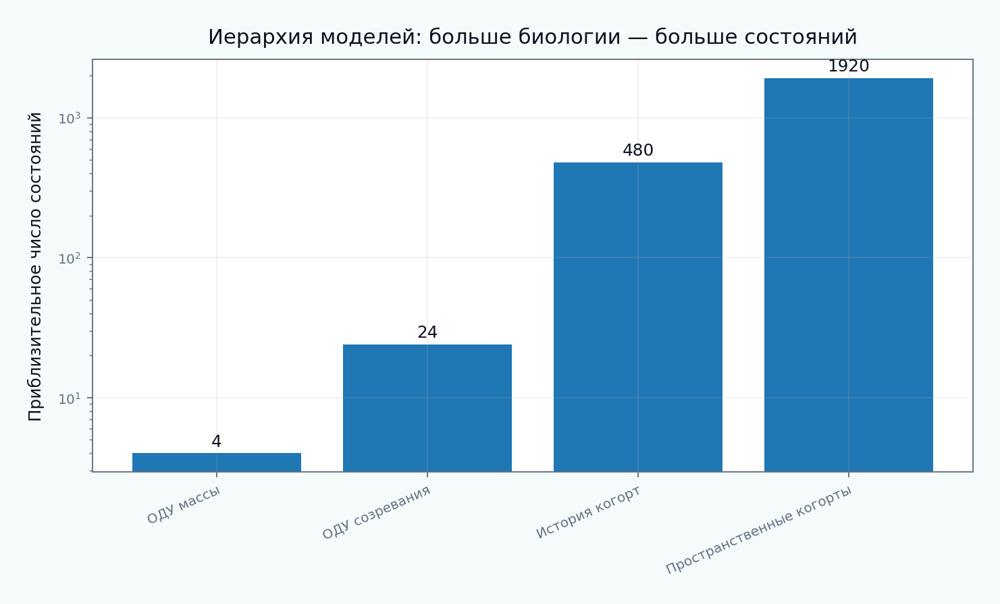

[English](README.md) | [Русский](README.ru.md)

# Tutorial 10 — Обновление внеклеточного матрикса

**Исследовательский вопрос:** как связать синтез, деградацию, созревание, возрастную структуру, сшивки, deposition stretch, воспаление и механическую функцию, не отождествляя общую массу с механическим качеством?

> Все параметры, временные масштабы, биохимические состояния и benchmark-значения являются синтетическими учебными примерами. Модуль ориентирован на верификацию и не заявляет валидацию для конкретной ткани, животного, пациента или клинической группы.



## Уровни моделирования

1. баланс общей массы открытой системы;
2. функции выживания и риска удаления;
3. явные возрастные когорты;
4. кинетика предшественника, незрелого и зрелого коллагена;
5. MMP/TIMP-регулируемая деградация;
6. созревание сшивок и изменение механики;
7. многокомпонентный turnover ECM;
8. пространственная реакционно-диффузионная деградация;
9. интерпретация в рамках constrained-mixture.

## Центральное различие

Постоянная общая масса коллагена может сочетаться с быстрым синтезом и удалением. Равная масса может иметь разный возраст, сшивки, deposition stretch и касательную жёсткость. Поэтому одной массы недостаточно для идентификации turnover и механики.

## Результаты обучения

После прохождения tutorial обучающийся сможет:

- замыкать и проверять баланс массы ECM;
- различать survival, hazard и half-life;
- сравнивать экспоненциальный и Weibull-законы;
- реализовать когорты и гомогенизированное ОДУ;
- объяснять условия их эквивалентности;
- разделять пулы предшественника, незрелого и зрелого коллагена;
- строить прозрачный закон активности MMP/TIMP;
- отделять созревание сшивок от массы;
- вычислять преднапряжение из deposition stretch;
- связывать turnover с определяющим откликом;
- сравнивать гомеостатический, фибротический, воспалительный и деградационный режимы;
- моделировать компонент-специфический turnover;
- воспроизводить локальный фронт деградации;
- планировать pulse–chase и мультимодальные наблюдения;
- диагностировать неидентифицируемость сбалансированных потоков;
- связывать редуцированную модель с constrained-mixture теорией Хамфри–Раджагопала.

## Структура tutorial

1. [Область, терминология и центральный вопрос моделирования](chapters/ru/01_scope_and_terminology.md)
2. [Иерархия ECM и роли отдельных компонентов](chapters/ru/02_ecm_hierarchy_and_components.md)
3. [Баланс массы открытой системы](chapters/ru/03_open_system_mass_balance.md)
4. [Синтез, секреция и сборка фибрилл](chapters/ru/04_synthesis_secretion_assembly.md)
5. [Деградация, MMP и TIMP](chapters/ru/05_degradation_mmp_timp.md)
6. [Функции выживания, риск удаления и период полураспада](chapters/ru/06_survival_hazard_half_life.md)
7. [Возрастные когорты и наследственная память](chapters/ru/07_age_structured_cohorts.md)
8. [Интерпретация в рамках constrained-mixture](chapters/ru/08_constrained_mixture_humphrey.md)
9. [Гомогенизированные и явные когортные модели](chapters/ru/09_homogenized_vs_cohort.md)
10. [Созревание коллагена и фибриллогенез](chapters/ru/10_maturation_fibrillogenesis.md)
11. [Сшивки, архитектура и механика](chapters/ru/11_crosslinks_and_mechanics.md)
12. [Deposition stretch и преднапряжение](chapters/ru/12_deposition_stretch_prestress.md)
13. [Механобиологическая обратная связь и история нагрузки](chapters/ru/13_mechanobiological_feedback.md)
14. [Многокомпонентный turnover ECM](chapters/ru/14_multicomponent_matrix.md)
15. [Воспаление, фиброз и деградационное ремоделирование](chapters/ru/15_inflammation_fibrosis_degradation.md)
16. [Пространственная неоднородность и ограничения транспорта](chapters/ru/16_spatial_heterogeneity.md)
17. [Экспериментальные наблюдаемые и логика pulse–chase](chapters/ru/17_experimental_observables.md)
18. [Идентифицируемость, компенсация параметров и неопределённость](chapters/ru/18_identifiability_uncertainty.md)
19. [Иерархия верификации и валидации](chapters/ru/19_verification_validation.md)
20. [Ограничения и направления исследований](chapters/ru/20_limitations_research_directions.md)

## Интерактивный notebook

```text
notebooks/10_extracellular_matrix_turnover_ru.ipynb
```

## Полное воспроизведение

```bash
python tutorials/10-extracellular-matrix-turnover/reproduce.py
```

## Основные результаты

- [modeling taxonomy](figures/modeling_taxonomy_ru.png);
- [homeostatic flux balance](figures/homeostatic_flux_balance_ru.png);
- [survival models](figures/survival_models_ru.png);
- [age structured cohorts](figures/age_structured_cohorts_ru.png);
- [cohort vs homogenized](figures/cohort_vs_homogenized_ru.png);
- [stress regulated synthesis](figures/stress_regulated_synthesis_ru.png);
- [mmp timp balance](figures/mmp_timp_balance_ru.png);
- [collagen maturation](figures/collagen_maturation_ru.png);
- [crosslink mechanics](figures/crosslink_mechanics_ru.png);
- [deposition stretch](figures/deposition_stretch_ru.png);
- [pulse chase](figures/pulse_chase_ru.png);
- [overload adaptation](figures/overload_adaptation_ru.png);
- [transient inflammation](figures/transient_inflammation_ru.png);
- [pathology modes](figures/pathology_modes_ru.png);
- [multicomponent ecm](figures/multicomponent_ecm_ru.png);
- [spatial degradation front](figures/spatial_degradation_front_ru.png);
- [mechanics coupling](figures/mechanics_coupling_ru.png);
- [identifiability](figures/identifiability_ru.png);
- [observability map](figures/observability_map_ru.png);
- [benchmark summary](figures/benchmark_summary_ru.png);
- [GIF turnover ECM](animations/ecm_turnover_ru.gif).

## Карта научных оснований

- Ланир (1983): структурная сумма вкладов компонентов;
- Хамфри и Раджагопал (2002): constrained-mixture производство, выживание и естественные конфигурации;
- Мартуфи и Гассер (2012): turnover фибриллярного коллагена;
- Майерс и Атешиан (2014): состав ткани как внутренние переменные;
- Сайрон, Айдин и Хамфри (2016): гомогенизированное constrained-mixture приближение;
- Хамфри (2021): двадцатилетняя перспектива constrained-mixture;
- Тилахун и соавторы (2023): биохимико-механическая модель производства, сборки и удаления коллагена;
- Хольцапфель и Огден (2020): микромеханика коллагена и сшивок;
- работы Табера: различение механической нагрузки, биологического ответа и эволюции естественного состояния.

Полная библиография приведена в [references.bib](references.bib).
