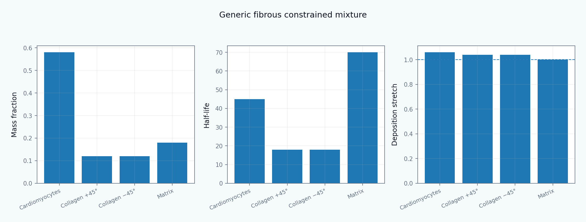

[English](README.md) | [Русский](README.ru.md)

# Tutorial 11 — Constrained-Mixture Toy Model

**Guiding question:** how can production, survival, natural configuration, constituent mechanics, and mechanobiological feedback be represented without collapsing every process into one bulk growth variable?

> All parameters, loading protocols, imaging-like fields, and benchmark values are synthetic. The module is verification-oriented and makes no experimental, clinical, or tissue-specific validation claim.



## Why this tutorial matters

Tutorials 06–10 introduce homeostasis, growth kinematics, volumetric growth, fiber remodeling, and ECM turnover. Tutorial 11 combines them at constituent level. It is deliberately universal: arteries, valves, myocardium, tendon, ligament, skin, airway, intestine, and engineered tissues are examples of one framework, not hard-coded targets.

## Learning outcomes

Learners will be able to:

- state and critique constrained-mixture assumptions;
- derive a discrete production–survival history;
- compute cohort elastic stretch and deposition prestress;
- assemble constituent and mixture stress consistently;
- initialize a homeostatic state;
- compare full-history, homogenized, and kinematic-growth descriptions;
- analyze transverse- and axial-dominated loading, accumulation, degradation, reversal, stability, and history truncation;
- use orientation-sensitive imaging as a structural prior without claiming it identifies turnover kinetics;
- design verification, observability, and identifiability tests.

## Tutorial structure

1. [Scope and research question](chapters/01_scope_and_research_question.md)
2. [Constrained-mixture hypotheses](chapters/02_hypotheses_of_constrained_mixture.md)
3. [Constituents and shared observable motion](chapters/03_constituents_and_shared_motion.md)
4. [Production, survival, and mass balance](chapters/04_mass_production_survival.md)
5. [Natural configurations and deposition stretch](chapters/05_natural_configurations.md)
6. [Constituent constitutive laws](chapters/06_constituent_constitutive_laws.md)
7. [Mixture stress and energy](chapters/07_mixture_stress_energy.md)
8. [Mechanobiologically equilibrated initialization](chapters/08_homeostatic_initialization.md)
9. [Constituent-specific mechanobiological feedback](chapters/09_constituent_specific_feedback.md)
10. [Full-history cohort algorithm](chapters/10_full_history_algorithm.md)
11. [Homogenized constrained-mixture reduction](chapters/11_homogenized_reduction.md)
12. [Comparison with kinematic growth](chapters/12_kinematic_growth_comparison.md)
13. [Generic multi-tissue examples](chapters/13_synthetic_myocardium.md)
14. [Transverse-dominated loading](chapters/14_pressure_overload.md)
15. [Axial-dominated loading](chapters/15_volume_overload.md)
16. [Accumulation, degradation, and reversal](chapters/16_fibrosis_degradation_reversal.md)
17. [History dependence, stability, and computational cost](chapters/17_history_stability_cost.md)
18. [Imaging-informed structural priors](chapters/18_polarization_imaging_bridge.md)
19. [Verification, observability, and identifiability](chapters/19_verification_identifiability.md)
20. [Limitations and extensions](chapters/20_limitations_and_research_extensions.md)

## Reproduce every result

```bash
python tutorials/11-constrained-mixture-toy-model/reproduce.py
```

## Main results

The module provides localized figures for model taxonomy, generic mixture architecture, homeostatic initialization, cohort survival, deposition stretch, stress decomposition, directional loading, reversal, degradation, history dependence, full-history versus homogenized reduction, stability, imaging-informed priors, observability, identifiability, and verification. See [RESULTS_MANIFEST.md](RESULTS_MANIFEST.md).

## Interactive notebook

`notebooks/11_constrained_mixture_toy_model.ipynb`

## Evidence map

The bibliography includes Humphrey and Rajagopal on constrained mixtures, Lanir on structural constitutive modeling, Taber on growth and remodeling, Cyron–Aydin–Humphrey on homogenized reductions, and tissue-specific examples that demonstrate how the universal framework is specialized. See [references.bib](references.bib).
