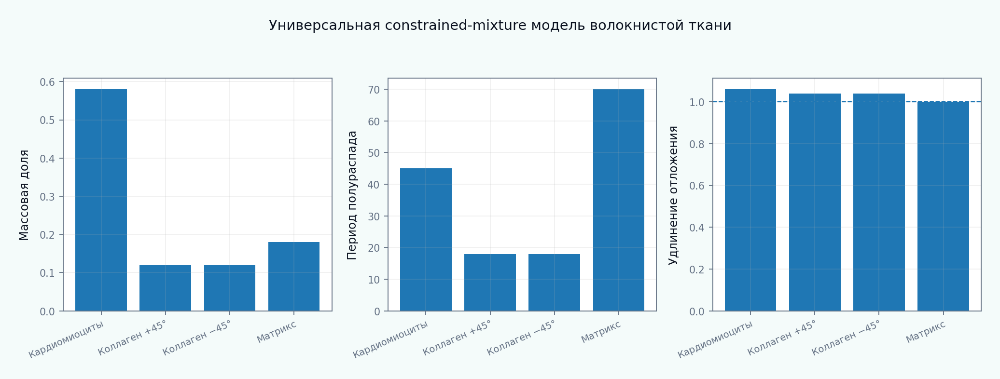

[English](README.md) | [Русский](README.ru.md)

# Tutorial 11 — Учебная constrained-mixture модель

**Исследовательский вопрос:** как в прозрачной компонентной модели связать адаптацию кардиомиоцитов, turnover коллагена, deposition prestretch, наследственную память, анизотропию миокарда и априорную структурную информацию из поляризационных данных, не скрывая всё внутри одной объёмной переменной роста?

> Все параметры, протоколы нагружения, поляризационно-подобные поля и benchmark-значения синтетические. Модуль ориентирован на верификацию и не заявляет экспериментальную, животную, клиническую или пациент-специфическую валидацию.



## Почему этот tutorial важен

Модуль объединяет Tutorials 06–10. Механический гомеостаз задаёт цели; кинематика роста — изменение естественного состояния; объёмный рост — скалярную обратную связь; ремоделирование семейств волокон — архитектуру; ECM turnover — производство и удаление. Constrained-mixture теория объединяет эти процессы на уровне компонентов.

Центральный пример содержит кардиомиоциты, два семейства коллагена и изотропный матрикс. Компоненты разделяют наблюдаемую деформацию, но имеют собственные массы, функции выживания, deposition stretch, определяющие соотношения, естественные состояния и механобиологические законы.

## Результаты обучения

После прохождения tutorial обучающийся сможет:

- сформулировать гипотезы constrained-mixture теории;
- получить дискретную когортную форму производственно-survival истории;
- вычислить упругое удлинение когорты по истории отложения;
- собрать напряжения компонентов и смеси;
- построить механобиологически равновесную инициализацию;
- различать full-history и homogenized constrained-mixture модели;
- сравнивать constrained mixture с кинематическим ростом;
- моделировать pressure-like и volume-like перегрузку миокарда;
- разделять гипертрофию кардиомиоцитов и коллагеновый фиброз;
- анализировать деградацию, обратимость, обрезку истории и устойчивость;
- преобразовывать синтетические поляризационные признаки в структурные prior-параметры без завышенных обратных утверждений;
- проектировать верификацию и идентифицируемость для учебн image-informed модели.

## Структура tutorial

1. [Область применения и исследовательский вопрос](chapters/ru/01_scope_and_research_question.md)
2. [Гипотезы constrained-mixture теории](chapters/ru/02_hypotheses_of_constrained_mixture.md)
3. [Компоненты и общее наблюдаемое движение](chapters/ru/03_constituents_and_shared_motion.md)
4. [Производство, выживание и баланс массы](chapters/ru/04_mass_production_survival.md)
5. [Естественные конфигурации и deposition stretch](chapters/ru/05_natural_configurations.md)
6. [Определяющие соотношения компонентов](chapters/ru/06_constituent_constitutive_laws.md)
7. [Напряжение и энергия смеси](chapters/ru/07_mixture_stress_energy.md)
8. [Механобиологически равновесная инициализация](chapters/ru/08_homeostatic_initialization.md)
9. [Компонент-специфическая механобиологическая обратная связь](chapters/ru/09_constituent_specific_feedback.md)
10. [Алгоритм с полной историей когорт](chapters/ru/10_full_history_algorithm.md)
11. [Гомогенизированное constrained-mixture приближение](chapters/ru/11_homogenized_reduction.md)
12. [Сравнение с кинематическим ростом](chapters/ru/12_kinematic_growth_comparison.md)
13. [Синтетическая смесь миокарда](chapters/ru/13_synthetic_myocardium.md)
14. [Pressure-like перегрузка и концентрическая адаптация](chapters/ru/14_pressure_overload.md)
15. [Volume-like перегрузка и эксцентрическая адаптация](chapters/ru/15_volume_overload.md)
16. [Фиброз, деградация и обратимость](chapters/ru/16_fibrosis_degradation_reversal.md)
17. [Зависимость от истории, устойчивость и вычислительная стоимость](chapters/ru/17_history_stability_cost.md)
18. [Переход к механике по поляризационным данным](chapters/ru/18_polarization_imaging_bridge.md)
19. [Верификация, наблюдаемость и идентифицируемость](chapters/ru/19_verification_identifiability.md)
20. [Ограничения и направления дальнейшего развития](chapters/ru/20_limitations_and_research_extensions.md)

## Полное воспроизведение

```bash
python tutorials/11-constrained-mixture-toy-model/reproduce.py
```

## Основные результаты

- [model taxonomy](figures/model_taxonomy_ru.png);
- [mixture architecture](figures/mixture_architecture_ru.png);
- [homeostatic initialization](figures/homeostatic_initialization_ru.png);
- [cohort survival](figures/cohort_survival_ru.png);
- [deposition stretch](figures/deposition_stretch_ru.png);
- [stress decomposition](figures/stress_decomposition_ru.png);
- [pressure overload](figures/pressure_overload_ru.png);
- [volume overload](figures/volume_overload_ru.png);
- [overload comparison](figures/overload_comparison_ru.png);
- [reversal](figures/reversal_ru.png);
- [fibrosis hypertrophy](figures/fibrosis_hypertrophy_ru.png);
- [collagen degradation](figures/collagen_degradation_ru.png);
- [history dependence](figures/history_dependence_ru.png);
- [cohort vs homogenized](figures/cohort_vs_homogenized_ru.png);
- [history truncation](figures/history_truncation_ru.png);
- [stability map](figures/stability_map_ru.png);
- [half life sensitivity](figures/half_life_sensitivity_ru.png);
- [polarimetry bridge](figures/polarimetry_bridge_ru.png);
- [observability map](figures/observability_map_ru.png);
- [identifiability](figures/identifiability_ru.png);
- [benchmark summary](figures/benchmark_summary_ru.png);
- [анимация constrained-mixture модели](animations/constrained_mixture_ru.gif).

## Интерактивный notebook

```text
notebooks/11_constrained_mixture_toy_model_ru.ipynb
```

## Карта научных оснований

- Хамфри и Раджагопал: исходная constrained-mixture теория;
- Ланир: структурное определяющее моделирование по компонентам;
- Табер: биомеханика роста, ремоделирования и морфогенеза;
- Валентин и Хамфри: чувствительность и конечно-элементные constrained-mixture модели;
- Сайрон, Айдын и Хамфри: гомогенизированное constrained-mixture приближение;
- Нестравска, Августин и Планк: ремоделирование сердца при перегрузке;
- Гебауэр и соавторы: constrained-mixture модель сердца, устойчивость и обратимость;
- Гуань и соавторы: updated-Lagrangian cardiac constrained-mixture модель.

Полная библиография приведена в [references.bib](references.bib).
