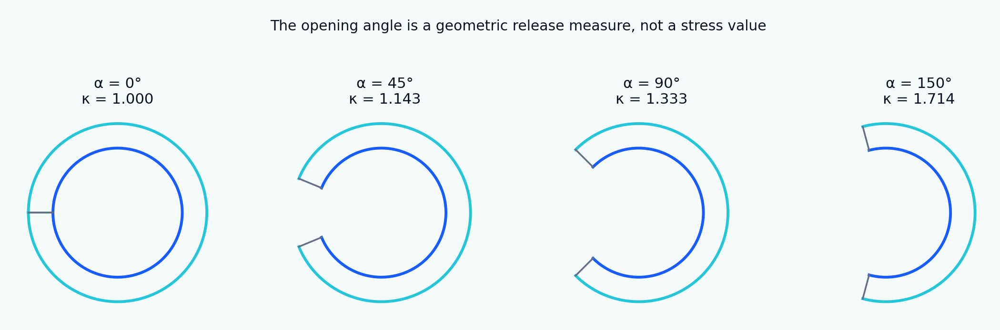

[English](README.md) | [Русский](README.ru.md)

# Tutorial 12 — Residual Stress and Ring Opening

**Guiding question:** what can released geometry reveal about hidden internal stress, and which conclusions require a constitutive and reference-configuration model?

> Every geometry, parameter, uncertainty distribution, and benchmark value is synthetic. This is a verification-oriented educational module, not a tissue-calibrated or clinical model.



## Scope

The tutorial starts from the classical arterial opening-angle experiment and expands to multilayer tubes, axial strips, plates, solid-organ slices, incompatible growth, initial-stress formulations, inverse problems, and uncertainty. Arteries are one example among vessels, airways, intestine, myocardium, skin, tendon, cartilage, developing tissues, tumors, swelling materials, and engineered constructs.

## Learning outcomes

Learners will be able to:

- distinguish residual stress, residual strain, prestress, and initial stress;
- derive open-sector closure kinematics and enforce incompressibility;
- solve unloaded and pressurized thick-wall equilibrium;
- test when residual stress homogenizes working stress;
- include axial prestretch, anisotropy, and multiple layers;
- model strip curling and growth-induced incompatibility;
- compare stress-free-reference and initial-stress formulations;
- design release experiments and propagate measurement uncertainty;
- analyze inverse non-uniqueness, verification, and validation.

## Tutorial structure

1. [Definitions and scope](chapters/01_definitions_and_scope.md)
2. [Biological and mechanical origins](chapters/02_biological_and_mechanical_origins.md)
3. [Configurations and cut release](chapters/03_configurations_and_cut_release.md)
4. [Open-sector kinematics](chapters/04_open_sector_kinematics.md)
5. [Constitutive assumptions](chapters/05_constitutive_assumptions.md)
6. [The inverse opening-angle problem](chapters/06_inverse_opening_angle_problem.md)
7. [Loaded tube equilibrium](chapters/07_loaded_tube_equilibrium.md)
8. [Stress redistribution and homogenization](chapters/08_stress_homogenization.md)
9. [Axial prestretch and three-dimensional coupling](chapters/09_axial_prestretch.md)
10. [Anisotropy and fiber reinforcement](chapters/10_anisotropy_and_fibers.md)
11. [Multilayer tissues and layer separation](chapters/11_multilayer_tissues.md)
12. [Noncircular opening and multiple cuts](chapters/12_noncircular_and_multicut.md)
13. [Strip and plate release](chapters/13_strip_and_plate_release.md)
14. [Solid organs and non-tubular tissues](chapters/14_solid_organs_and_non_tubular_tissues.md)
15. [Growth-induced incompatibility](chapters/15_growth_incompatibility.md)
16. [Initial-stress and stress-free-reference formulations](chapters/16_initial_stress_formulations.md)
17. [Experimental protocols and measurement practice](chapters/17_experimental_protocols.md)
18. [Uncertainty and identifiability](chapters/18_uncertainty_and_identifiability.md)
19. [Verification and validation hierarchy](chapters/19_verification_and_validation.md)
20. [Limitations and extensions](chapters/20_limitations_and_extensions.md)

## Reproduce every result

```bash
python tutorials/12-residual-stress-ring-opening/reproduce.py
```

## Results

Twenty-two reproducible scenarios generate localized figures, a GIF release animation, and a synthetic verification benchmark. See [RESULTS_MANIFEST.md](RESULTS_MANIFEST.md).

## Notebook

`notebooks/12_residual_stress_ring_opening.ipynb`

## Scientific lineage

The bibliography includes Chuong and Fung on arterial residual stress, Fung on physiological interpretation, Omens and Fung on myocardium, Taber and Humphrey on stress-modulated growth, Rachev and Greenwald on vascular residual strain, Holzapfel and collaborators on anisotropic/multilayer mechanics, and later full-field and multi-cut inverse methods. See [references.bib](references.bib).
