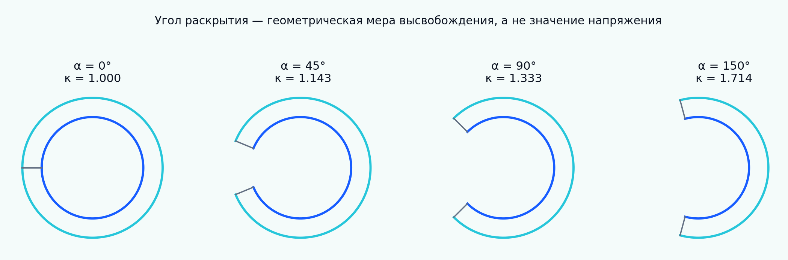

[English](README.md) | [Русский](README.ru.md)

# Tutorial 12 — Остаточные напряжения и раскрытие кольца

**Основной вопрос:** что высвобождённая геометрия сообщает о скрытом внутреннем напряжении и какие выводы требуют определяющей модели и явного выбора отсчётной конфигурации?

> Все геометрии, параметры, распределения неопределённости и benchmark-значения синтетические. Это верификационный учебный модуль, а не тканеспецифическая или клиническая модель.



## Область применения

Tutorial начинается с классического эксперимента раскрытия артериального кольца и расширяет его до многослойных трубок, продольных полос, пластин, срезов массивных органов, несовместимого роста, формулировок начальных напряжений, обратных задач и анализа неопределённости. Артерии являются одним из примеров наряду с сосудами, дыхательными путями, кишечником, миокардом, кожей, сухожилиями, хрящом, развивающимися тканями, опухолями, набухающими материалами и инженерными конструкциями.

## Результаты обучения

Обучающийся сможет:

- различать остаточное напряжение, остаточную деформацию, преднапряжение и начальное напряжение;
- выводить кинематику замыкания сектора и обеспечивать несжимаемость;
- решать равновесие разгруженной и нагруженной толстостенной трубки;
- проверять условия выравнивания рабочего напряжения;
- учитывать осевое предрастяжение, анизотропию и многослойность;
- моделировать изгиб полосы и несовместимость, вызванную ростом;
- сравнивать ненапряжённую отсчётную и initial-stress формулировки;
- проектировать эксперименты высвобождения и распространять неопределённость измерений;
- анализировать неединственность обратной задачи, верификацию и валидацию.

## Структура tutorial

1. [Определения и область применения](chapters/ru/01_definitions_and_scope.md)
2. [Биологические и механические источники](chapters/ru/02_biological_and_mechanical_origins.md)
3. [Конфигурации и высвобождение разрезом](chapters/ru/03_configurations_and_cut_release.md)
4. [Кинематика раскрытого сектора](chapters/ru/04_open_sector_kinematics.md)
5. [Определяющие предположения](chapters/ru/05_constitutive_assumptions.md)
6. [Обратная задача по углу раскрытия](chapters/ru/06_inverse_opening_angle_problem.md)
7. [Равновесие нагруженной трубки](chapters/ru/07_loaded_tube_equilibrium.md)
8. [Перераспределение и выравнивание напряжений](chapters/ru/08_stress_homogenization.md)
9. [Осевое предрастяжение и трёхмерная связь](chapters/ru/09_axial_prestretch.md)
10. [Анизотропия и волокнистое армирование](chapters/ru/10_anisotropy_and_fibers.md)
11. [Многослойные ткани и разделение слоёв](chapters/ru/11_multilayer_tissues.md)
12. [Некруговое раскрытие и множественные разрезы](chapters/ru/12_noncircular_and_multicut.md)
13. [Высвобождение полос и пластин](chapters/ru/13_strip_and_plate_release.md)
14. [Массивные органы и нетрубчатые ткани](chapters/ru/14_solid_organs_and_non_tubular_tissues.md)
15. [Несовместимость, вызванная ростом](chapters/ru/15_growth_incompatibility.md)
16. [Формулировки начальных напряжений и ненапряжённой конфигурации](chapters/ru/16_initial_stress_formulations.md)
17. [Экспериментальные протоколы и практика измерений](chapters/ru/17_experimental_protocols.md)
18. [Неопределённость и идентифицируемость](chapters/ru/18_uncertainty_and_identifiability.md)
19. [Иерархия верификации и валидации](chapters/ru/19_verification_and_validation.md)
20. [Ограничения и расширения](chapters/ru/20_limitations_and_extensions.md)

## Воспроизведение результатов

```bash
python tutorials/12-residual-stress-ring-opening/reproduce.py
```

## Результаты

Двадцать два воспроизводимых сценария создают локализованные рисунки, GIF-анимацию высвобождения и синтетический benchmark. См. [RESULTS_MANIFEST.ru.md](RESULTS_MANIFEST.ru.md).

## Notebook

`notebooks/12_residual_stress_ring_opening_ru.ipynb`

## Научная линия

Библиография включает работы Chuong и Fung по остаточным напряжениям артерий, Fung по физиологической интерпретации, Omens и Fung по миокарду, Taber и Humphrey по стресс-зависимому росту, Rachev и Greenwald по остаточным деформациям сосудов, Holzapfel и соавторов по анизотропной и многослойной механике, а также более поздние полно-полевые и multi-cut обратные методы. См. [references.bib](references.bib).
