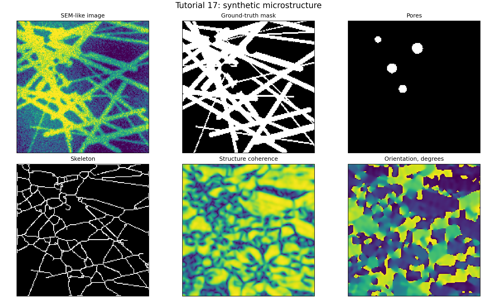
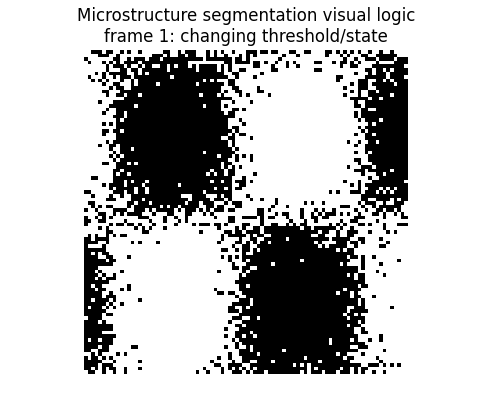
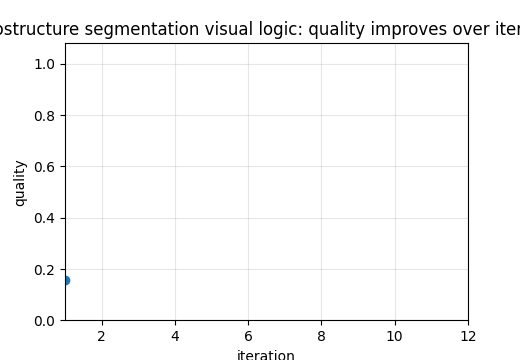

# Tutorial 17 — Microstructure Segmentation: Classical Methods, SAM and μSAM

[English](README.md) | [Русский](README.ru.md)

**Main question:** How do classical, learnable and prompt-based methods compare under structural metrics?

This tutorial is part of **Biomechanics Research Tutorials**.  It is a synthetic, reproducible teaching module: the data are generated by code, the figures are regenerated by `reproduce.py`, and the assumptions are stated explicitly.

## What this tutorial builds

- synthetic microstructures with fibres, pores, crossings, thin objects and ambiguous boundaries;
- classical segmentation baselines: global/adaptive thresholding, Otsu, morphology, watershed, connected components and distance-transform logic;
- educational learnable baselines: random forest, patch classifier, U-Net-like multiscale baseline and domain augmentation;
- prompt-aware SAM/μSAM-style benchmark scenarios with point, box, positive/negative and automatic-mask modes;

## What is measured

- Dice, IoU, precision and recall;
- boundary F-score and Hausdorff distance;
- skeleton precision, topology errors and fibre continuity;
- orientation, diameter and pore-size errors;

## Why it matters

The point is to evaluate segmentation as a structural operation, not as a cosmetic mask overlay. A mask that looks acceptable can still damage fibre continuity, diameter, topology and downstream RVE response.

## Visual outputs







Russian visual counterparts are available in [README.ru.md](README.ru.md).

## Run

From the repository root:

```bash
python tutorials/17-microstructure-segmentation-sam-usam/reproduce.py
pytest tutorials/17-microstructure-segmentation-sam-usam/tests -q
```

## Files

- `reproduce.py` regenerates data, tables, figures and animations.
- `chapters/` contains the English lesson chapters.
- `chapters/ru/` contains the Russian lesson chapters.
- `notebooks/` contains English and Russian notebooks.
- `figures/` contains static visualizations.
- `animations/` contains GIF animations, including localized Russian pairs when labels are present.
- `data/` contains synthetic arrays and benchmark tables.
- `tests/` contains compact correctness checks.

## Interpretation rule

The module is verification-ready, not experimental validation.  The correct interpretation is: *given known synthetic truth, can this computational step recover the quantity it is supposed to recover, and how does the error affect the next biomechanical step?*
