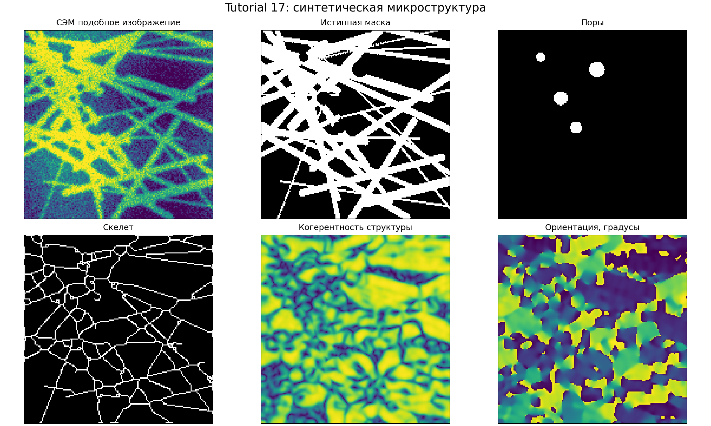
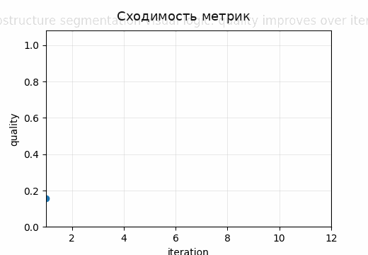
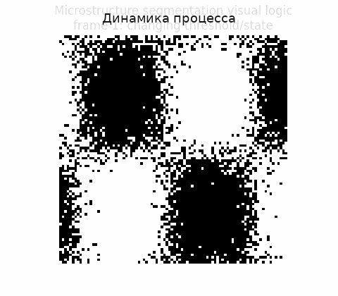

# Tutorial 17 — Сегментация микроструктуры: классические методы, SAM и μSAM

[English](README.md) | [Русский](README.ru.md)

**Главный вопрос:** Как сравнить классические, обучаемые и prompt-based методы по структурным метрикам?

Этот tutorial входит в серию **Biomechanics Research Tutorials**.  Это синтетический и воспроизводимый учебный модуль: данные создаются кодом, рисунки пересоздаются через `reproduce.py`, а допущения явно описаны в главах.

## Что строится в этом tutorial

- синтетические микроструктуры с волокнами, порами, пересечениями, тонкими объектами и неоднозначными границами;
- классические baselines: global/adaptive thresholding, Otsu, morphology, watershed, connected components и distance transform;
- учебные обучаемые baselines: random forest, patch classifier, U-Net-like multiscale baseline и domain augmentation;
- prompt-aware SAM/μSAM-style benchmark: точки, box prompts, positive/negative prompts и automatic masks;

## Что измеряется

- Dice, IoU, precision и recall;
- boundary F-score и Hausdorff distance;
- skeleton precision, topology errors и fibre continuity;
- ошибки ориентации, диаметра и размера пор;

## Почему это важно

Главная идея — оценивать сегментацию как структурную операцию. Маска может визуально выглядеть хорошей, но разрушать связность волокон, толщины, топологию и последующий RVE-отклик.

## Визуальные результаты







Английские визуальные версии доступны в [README.md](README.md).

## Запуск

Из корня репозитория:

```bash
python tutorials/17-microstructure-segmentation-sam-usam/reproduce.py
pytest tutorials/17-microstructure-segmentation-sam-usam/tests -q
```

## Файлы

- `reproduce.py` пересоздаёт данные, таблицы, рисунки и анимации.
- `chapters/` содержит английские главы.
- `chapters/ru/` содержит русские главы.
- `notebooks/` содержит английский и русский notebook.
- `figures/` содержит статичные визуализации.
- `animations/` содержит GIF-анимации, включая русские локализованные пары, если в анимации есть поясняющие подписи.
- `data/` содержит синтетические массивы и benchmark-таблицы.
- `tests/` содержит компактные проверки корректности.

## Правило интерпретации

Модуль является verification-ready, но не экспериментальной валидацией.  Правильная трактовка такая: *если синтетическая истина известна, может ли этот вычислительный этап восстановить нужную величину, и как ошибка влияет на следующий биомеханический шаг?*
