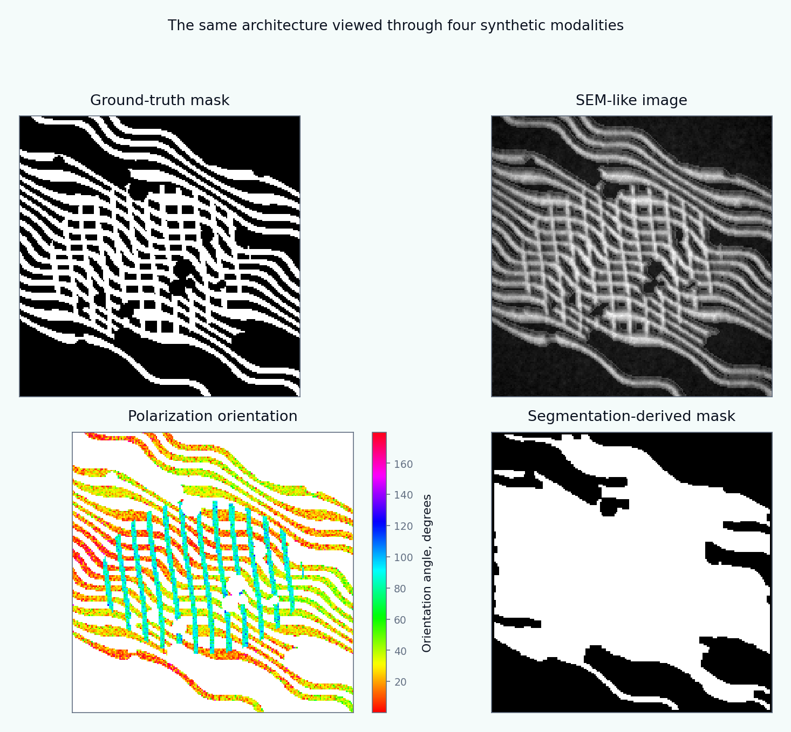
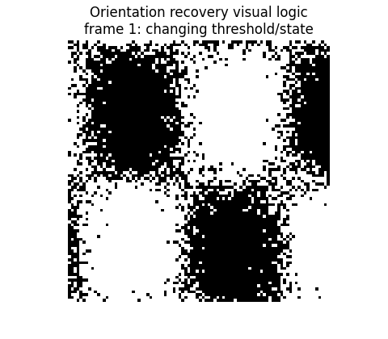
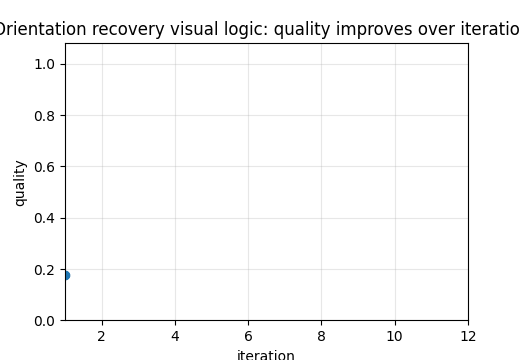

# Tutorial 18 — Orientation Distributions and Concentration Parameters

[English](README.md) | [Русский](README.ru.md)

**Main question:** How consistently is one architecture recovered from ground truth, SEM-like, polarization-like and segmented-mask modalities?

This tutorial is part of **Biomechanics Research Tutorials**.  It is a synthetic, reproducible teaching module: the data are generated by code, the figures are regenerated by `reproduce.py`, and the assumptions are stated explicitly.

## What this tutorial builds

- one ground-truth fibrous architecture represented through multiple modalities;
- ODF estimates from exact geometry, SEM-like intensity, polarization-like angle maps and segmented masks;
- axial mean direction, resultant length, von-Mises concentration, orientation tensor and entropy;
- modality-comparison metrics and a simple stiffness index;

## What is measured

- orientation MAE;
- Jensen-Shannon divergence between ODFs;
- resultant length and concentration error;
- anisotropy and stiffness-index deviation;

## Why it matters

This tutorial explains why orientation recovery is not a single-image problem: the same tissue architecture can look different depending on the modality and preprocessing pipeline.

## Visual outputs







Russian visual counterparts are available in [README.ru.md](README.ru.md).

## Run

From the repository root:

```bash
python tutorials/18-orientation-distributions-concentration/reproduce.py
pytest tutorials/18-orientation-distributions-concentration/tests -q
```

## Files

- `reproduce.py` regenerates data, tables, figures and animations.
- `chapters/` contains the English lesson chapters.
- `chapters/ru/` contains the Russian lesson chapters.
- `notebooks/` contains English and Russian notebooks.
- `figures/` contains static visualizations.
- `animations/` contains GIF animations, including localized Russian pairs when labels are present.
- `data/` contains synthetic arrays and benchmark tables.
- `tests/` contains compact correctness checks.

## Interpretation rule

The module is verification-ready, not experimental validation.  The correct interpretation is: *given known synthetic truth, can this computational step recover the quantity it is supposed to recover, and how does the error affect the next biomechanical step?*
