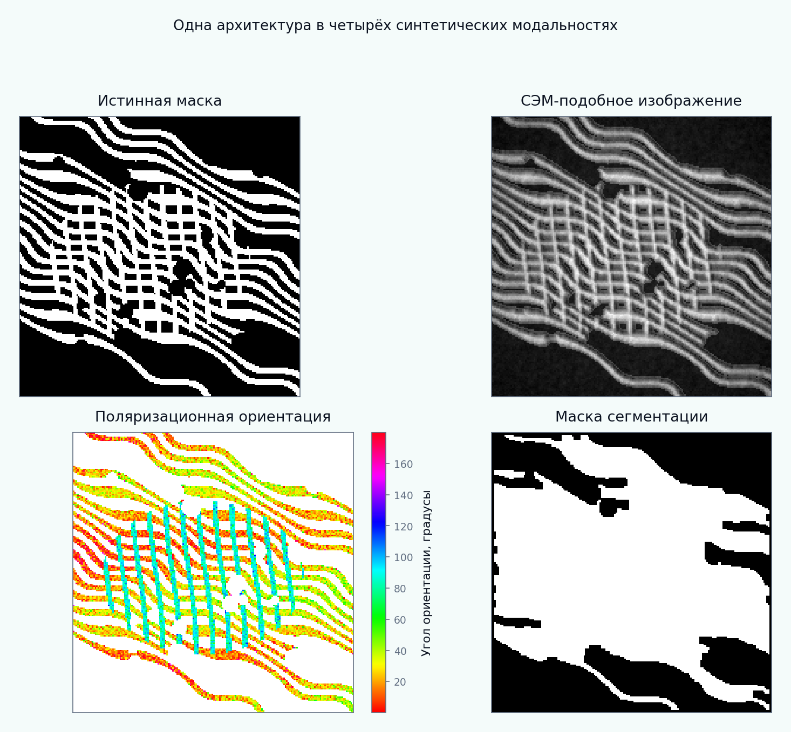
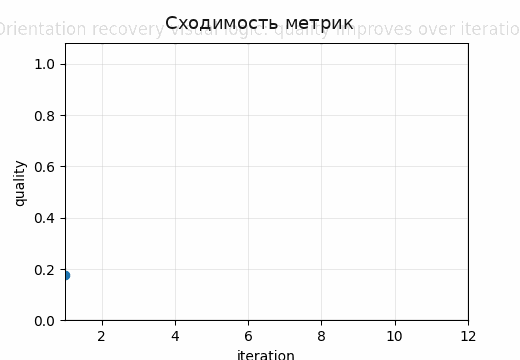
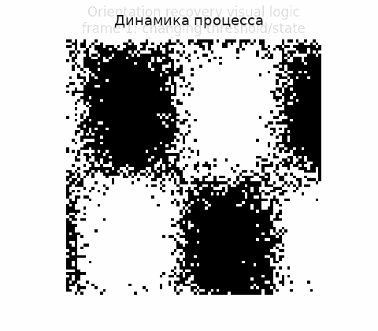

# Tutorial 18 — Распределения ориентаций и параметры концентрации

[English](README.md) | [Русский](README.ru.md)

**Главный вопрос:** Насколько согласованно одна архитектура восстанавливается из ground truth, СЭМ-подобных, поляризационных и масочных представлений?

Этот tutorial входит в серию **Biomechanics Research Tutorials**.  Это синтетический и воспроизводимый учебный модуль: данные создаются кодом, рисунки пересоздаются через `reproduce.py`, а допущения явно описаны в главах.

## Что строится в этом tutorial

- одна ground-truth волокнистая архитектура, представленная через несколько модальностей;
- ODF из точной геометрии, СЭМ-подобного изображения, поляризационной карты и сегментированной маски;
- axial mean direction, resultant length, von-Mises concentration, orientation tensor и entropy;
- метрики сравнения модальностей и простой stiffness index;

## Что измеряется

- orientation MAE;
- Jensen-Shannon divergence между ODF;
- ошибка resultant length и concentration;
- отклонение anisotropy и stiffness-index;

## Почему это важно

Модуль показывает, что восстановление ориентации — это не задача одного изображения: одна и та же архитектура ткани может давать разные оценки после разных модальностей и preprocess pipelines.

## Визуальные результаты







Английские визуальные версии доступны в [README.md](README.md).

## Запуск

Из корня репозитория:

```bash
python tutorials/18-orientation-distributions-concentration/reproduce.py
pytest tutorials/18-orientation-distributions-concentration/tests -q
```

## Файлы

- `reproduce.py` пересоздаёт данные, таблицы, рисунки и анимации.
- `chapters/` содержит английские главы.
- `chapters/ru/` содержит русские главы.
- `notebooks/` содержит английский и русский notebook.
- `figures/` содержит статичные визуализации.
- `animations/` содержит GIF-анимации, включая русские локализованные пары, если в анимации есть поясняющие подписи.
- `data/` содержит синтетические массивы и benchmark-таблицы.
- `tests/` содержит компактные проверки корректности.

## Правило интерпретации

Модуль является verification-ready, но не экспериментальной валидацией.  Правильная трактовка такая: *если синтетическая истина известна, может ли этот вычислительный этап восстановить нужную величину, и как ошибка влияет на следующий биомеханический шаг?*
