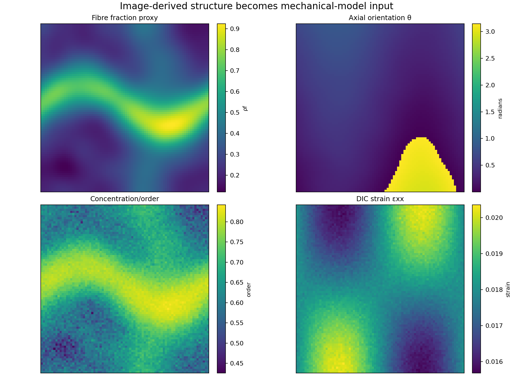
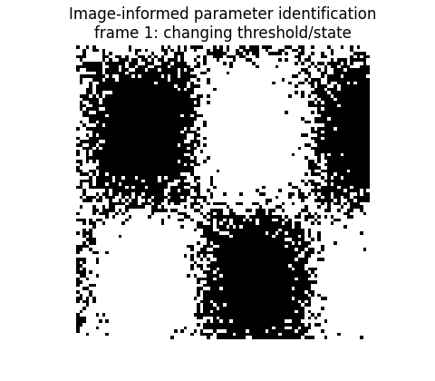
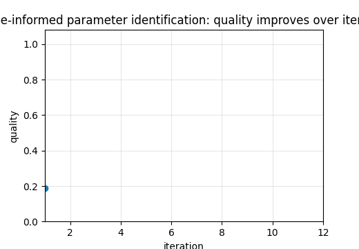

# Tutorial 19 — Image-Informed Constitutive Parameters

[English](README.md) | [Русский](README.ru.md)

**Main question:** How can image-derived structure, DIC strain fields and force data identify material parameters?

This tutorial is part of **Biomechanics Research Tutorials**.  It is a synthetic, reproducible teaching module: the data are generated by code, the figures are regenerated by `reproduce.py`, and the assumptions are stated explicitly.

## What this tutorial builds

- image-derived structural descriptors: fibre fraction, orientation, concentration and connectivity;
- DIC-like strain fields and force observations under several load cases;
- linear-in-parameters anisotropic constitutive model;
- load-only, virtual-field-style, joint and inverse-FE-like calibration workflows;
- Bayesian linear posterior and identifiability diagnostics;

## What is measured

- parameter error;
- force residuals;
- condition numbers and singular values;
- posterior intervals;
- spatial material-map summaries;

## Why it matters

The module shifts from image analysis to mechanics: images provide structural priors, while DIC and forces constrain constitutive parameters.

## Visual outputs







Russian visual counterparts are available in [README.ru.md](README.ru.md).

## Run

From the repository root:

```bash
python tutorials/19-image-informed-constitutive-parameters/reproduce.py
pytest tutorials/19-image-informed-constitutive-parameters/tests -q
```

## Files

- `reproduce.py` regenerates data, tables, figures and animations.
- `chapters/` contains the English lesson chapters.
- `chapters/ru/` contains the Russian lesson chapters.
- `notebooks/` contains English and Russian notebooks.
- `figures/` contains static visualizations.
- `animations/` contains GIF animations, including localized Russian pairs when labels are present.
- `data/` contains synthetic arrays and benchmark tables.
- `tests/` contains compact correctness checks.

## Interpretation rule

The module is verification-ready, not experimental validation.  The correct interpretation is: *given known synthetic truth, can this computational step recover the quantity it is supposed to recover, and how does the error affect the next biomechanical step?*
