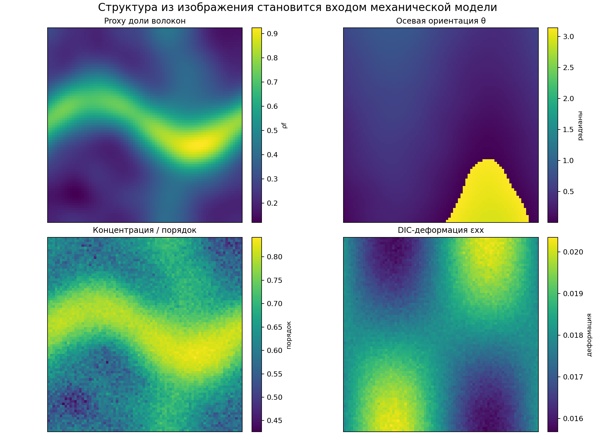
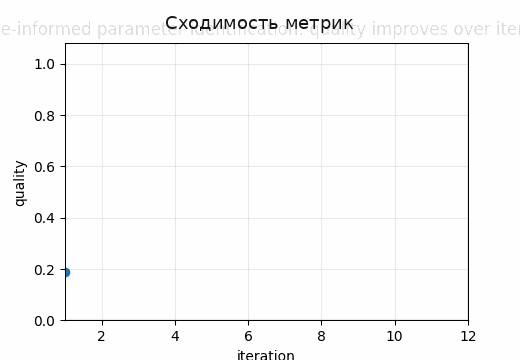
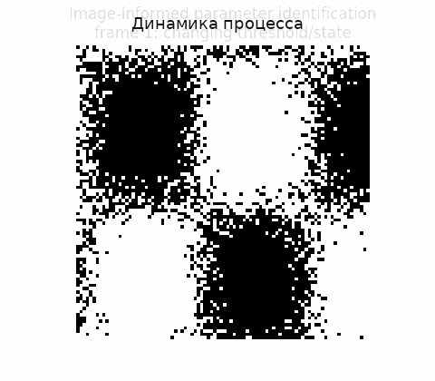

# Tutorial 19 — Image-informed параметры механических моделей

[English](README.md) | [Русский](README.ru.md)

**Главный вопрос:** Как структура из изображений, DIC-поля деформаций и силовые данные помогают идентифицировать параметры материала?

Этот tutorial входит в серию **Biomechanics Research Tutorials**.  Это синтетический и воспроизводимый учебный модуль: данные создаются кодом, рисунки пересоздаются через `reproduce.py`, а допущения явно описаны в главах.

## Что строится в этом tutorial

- image-derived структурные признаки: fibre fraction, orientation, concentration и connectivity;
- DIC-like поля деформаций и силовые наблюдения для нескольких load cases;
- анизотропная constitutive model, линейная по параметрам;
- load-only, virtual-field-style, joint и inverse-FE-like calibration workflows;
- байесовская линейная posterior-модель и диагностика идентифицируемости;

## Что измеряется

- ошибка параметров;
- невязки сил;
- condition numbers и singular values;
- posterior intervals;
- сводки spatial material maps;

## Почему это важно

Модуль переводит задачу от анализа изображений к механике: изображения задают структурные priors, а DIC и силы ограничивают параметры конститутивной модели.

## Визуальные результаты







Английские визуальные версии доступны в [README.md](README.md).

## Запуск

Из корня репозитория:

```bash
python tutorials/19-image-informed-constitutive-parameters/reproduce.py
pytest tutorials/19-image-informed-constitutive-parameters/tests -q
```

## Файлы

- `reproduce.py` пересоздаёт данные, таблицы, рисунки и анимации.
- `chapters/` содержит английские главы.
- `chapters/ru/` содержит русские главы.
- `notebooks/` содержит английский и русский notebook.
- `figures/` содержит статичные визуализации.
- `animations/` содержит GIF-анимации, включая русские локализованные пары, если в анимации есть поясняющие подписи.
- `data/` содержит синтетические массивы и benchmark-таблицы.
- `tests/` содержит компактные проверки корректности.

## Правило интерпретации

Модуль является verification-ready, но не экспериментальной валидацией.  Правильная трактовка такая: *если синтетическая истина известна, может ли этот вычислительный этап восстановить нужную величину, и как ошибка влияет на следующий биомеханический шаг?*
