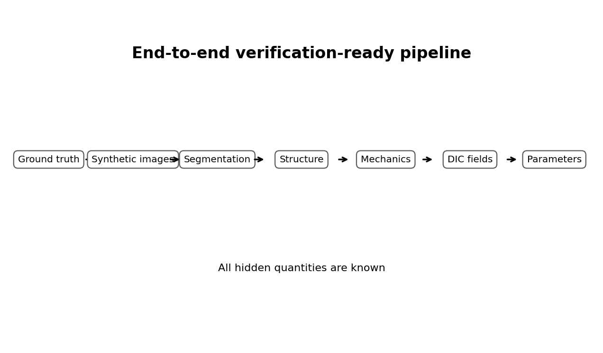
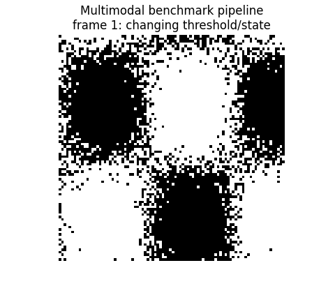
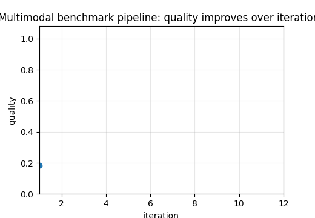

# Tutorial 20 — Multimodal Verification-Ready Synthetic Benchmark

[English](README.md) | [Русский](README.ru.md)

**Main question:** Can the full image-to-mechanics pipeline recover known masks, orientations, strains, forces and parameters?

This tutorial is part of **Biomechanics Research Tutorials**.  It is a synthetic, reproducible teaching module: the data are generated by code, the figures are regenerated by `reproduce.py`, and the assumptions are stated explicitly.

## What this tutorial builds

- hidden ground-truth microstructure with masks, orientation, density and true material parameters;
- SEM-like, polarization-like, fluorescence-like and DIC-like synthetic modalities;
- segmentation, multimodal fusion and orientation recovery;
- mechanical forward simulation and inverse parameter identification;
- stage-by-stage error budget;

## What is measured

- segmentation metrics;
- orientation and concentration errors;
- strain and force errors;
- parameter recovery error;
- error-budget attribution;

## Why it matters

This is the full verification chain: every hidden truth is known, so every stage from image to parameter can be audited quantitatively.

## Visual outputs







Russian visual counterparts are available in [README.ru.md](README.ru.md).

## Run

From the repository root:

```bash
python tutorials/20-multimodal-verification-ready-benchmark/reproduce.py
pytest tutorials/20-multimodal-verification-ready-benchmark/tests -q
```

## Files

- `reproduce.py` regenerates data, tables, figures and animations.
- `chapters/` contains the English lesson chapters.
- `chapters/ru/` contains the Russian lesson chapters.
- `notebooks/` contains English and Russian notebooks.
- `figures/` contains static visualizations.
- `animations/` contains GIF animations, including localized Russian pairs when labels are present.
- `data/` contains synthetic arrays and benchmark tables.
- `tests/` contains compact correctness checks.

## Interpretation rule

The module is verification-ready, not experimental validation.  The correct interpretation is: *given known synthetic truth, can this computational step recover the quantity it is supposed to recover, and how does the error affect the next biomechanical step?*
