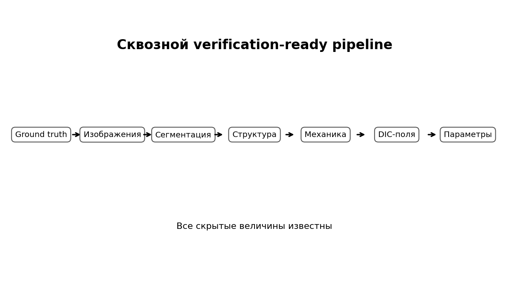
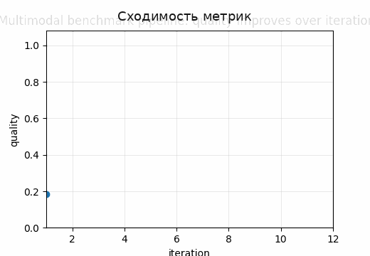
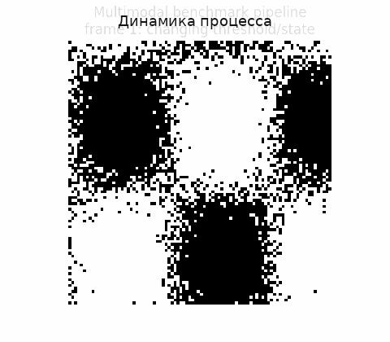

# Tutorial 20 — Мультимодальный verification-ready synthetic benchmark

[English](README.md) | [Русский](README.ru.md)

**Главный вопрос:** Можно ли проверить весь путь от изображения до механического параметра, если известны истинные маски, ориентации, деформации, силы и параметры?

Этот tutorial входит в серию **Biomechanics Research Tutorials**.  Это синтетический и воспроизводимый учебный модуль: данные создаются кодом, рисунки пересоздаются через `reproduce.py`, а допущения явно описаны в главах.

## Что строится в этом tutorial

- hidden ground-truth микроструктура с масками, ориентацией, плотностью и истинными material parameters;
- SEM-like, polarization-like, fluorescence-like и DIC-like синтетические модальности;
- segmentation, multimodal fusion и orientation recovery;
- прямое механическое моделирование и inverse parameter identification;
- поэтапный error budget;

## Что измеряется

- segmentation metrics;
- ошибки ориентации и концентрации;
- ошибки деформаций и сил;
- ошибка восстановления параметров;
- stage-wise error budget;

## Почему это важно

Это полный verification chain: все истинные величины известны, поэтому каждый этап от изображения до параметра можно количественно проверить.

## Визуальные результаты







Английские визуальные версии доступны в [README.md](README.md).

## Запуск

Из корня репозитория:

```bash
python tutorials/20-multimodal-verification-ready-benchmark/reproduce.py
pytest tutorials/20-multimodal-verification-ready-benchmark/tests -q
```

## Файлы

- `reproduce.py` пересоздаёт данные, таблицы, рисунки и анимации.
- `chapters/` содержит английские главы.
- `chapters/ru/` содержит русские главы.
- `notebooks/` содержит английский и русский notebook.
- `figures/` содержит статичные визуализации.
- `animations/` содержит GIF-анимации, включая русские локализованные пары, если в анимации есть поясняющие подписи.
- `data/` содержит синтетические массивы и benchmark-таблицы.
- `tests/` содержит компактные проверки корректности.

## Правило интерпретации

Модуль является verification-ready, но не экспериментальной валидацией.  Правильная трактовка такая: *если синтетическая истина известна, может ли этот вычислительный этап восстановить нужную величину, и как ошибка влияет на следующий биомеханический шаг?*
