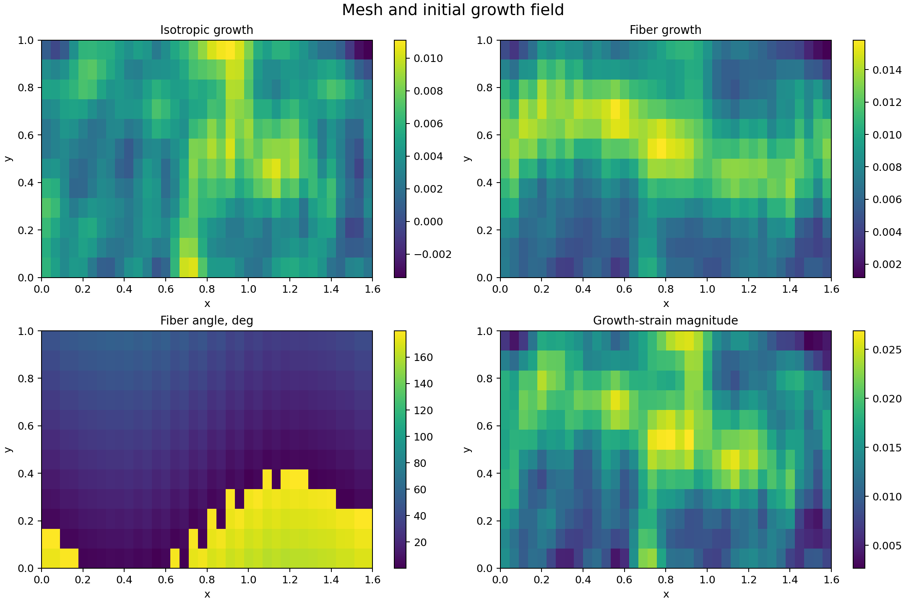
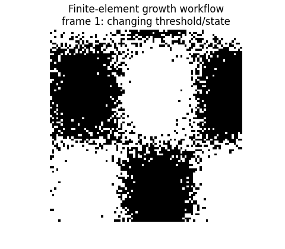
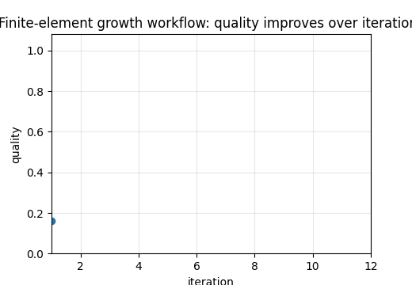

# Tutorial 21 — Finite-Element Growth Model

[English](README.md) | [Русский](README.ru.md)

**Main question:** How does incompatible growth become elastic accommodation, residual stress and feedback in a finite-element model?

This tutorial is part of **Biomechanics Research Tutorials**.  It is a synthetic, reproducible teaching module: the data are generated by code, the figures are regenerated by `reproduce.py`, and the assumptions are stated explicitly.

## What this tutorial builds

- 2-D triangular finite-element mesh;
- constant-strain triangular elements and explicit stiffness assembly;
- isotropic and fibre-aligned growth/eigenstrain;
- boundary conditions that remove rigid-body modes;
- stress-driven growth update and residual checks;

## What is measured

- equilibrium residual;
- reaction norm;
- energy density;
- trace stress and fibre stress;
- scenario comparison and mesh diagnostics;

## Why it matters

The tutorial exposes how incompatible growth becomes elastic accommodation and residual stress once equilibrium and boundary constraints are imposed.

## Visual outputs







Russian visual counterparts are available in [README.ru.md](README.ru.md).

## Run

From the repository root:

```bash
python tutorials/21-finite-element-growth-model/reproduce.py
pytest tutorials/21-finite-element-growth-model/tests -q
```

## Files

- `reproduce.py` regenerates data, tables, figures and animations.
- `chapters/` contains the English lesson chapters.
- `chapters/ru/` contains the Russian lesson chapters.
- `notebooks/` contains English and Russian notebooks.
- `figures/` contains static visualizations.
- `animations/` contains GIF animations, including localized Russian pairs when labels are present.
- `data/` contains synthetic arrays and benchmark tables.
- `tests/` contains compact correctness checks.

## Interpretation rule

The module is verification-ready, not experimental validation.  The correct interpretation is: *given known synthetic truth, can this computational step recover the quantity it is supposed to recover, and how does the error affect the next biomechanical step?*
