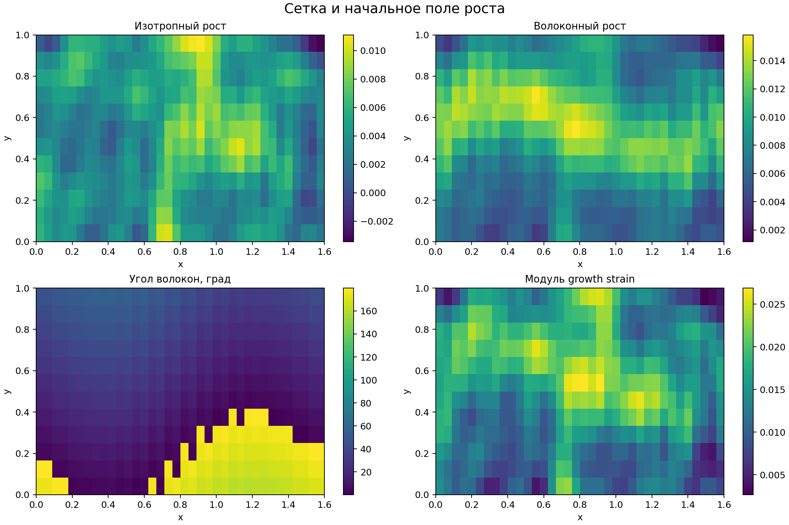
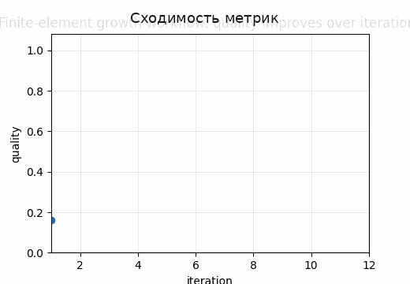
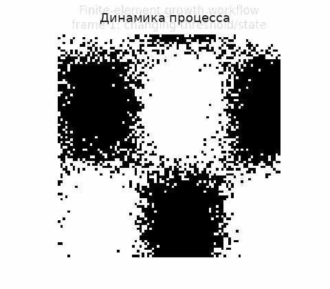

# Tutorial 21 — Конечно-элементная модель роста

[English](README.md) | [Русский](README.ru.md)

**Главный вопрос:** Как несовместимый рост превращается в упругую аккомодацию, остаточные напряжения и feedback в FE-модели?

Этот tutorial входит в серию **Biomechanics Research Tutorials**.  Это синтетический и воспроизводимый учебный модуль: данные создаются кодом, рисунки пересоздаются через `reproduce.py`, а допущения явно описаны в главах.

## Что строится в этом tutorial

- двумерная треугольная FE-сетка;
- constant-strain triangular elements и явная assembly матрицы жёсткости;
- изотропный и fibre-aligned growth/eigenstrain;
- граничные условия, убирающие rigid-body modes;
- stress-driven growth update и residual checks;

## Что измеряется

- equilibrium residual;
- reaction norm;
- energy density;
- trace stress и fibre stress;
- сравнение сценариев и mesh diagnostics;

## Почему это важно

Модуль показывает, как несовместимый рост превращается в упругую аккомодацию и остаточные напряжения после задания равновесия и граничных ограничений.

## Визуальные результаты







Английские визуальные версии доступны в [README.md](README.md).

## Запуск

Из корня репозитория:

```bash
python tutorials/21-finite-element-growth-model/reproduce.py
pytest tutorials/21-finite-element-growth-model/tests -q
```

## Файлы

- `reproduce.py` пересоздаёт данные, таблицы, рисунки и анимации.
- `chapters/` содержит английские главы.
- `chapters/ru/` содержит русские главы.
- `notebooks/` содержит английский и русский notebook.
- `figures/` содержит статичные визуализации.
- `animations/` содержит GIF-анимации, включая русские локализованные пары, если в анимации есть поясняющие подписи.
- `data/` содержит синтетические массивы и benchmark-таблицы.
- `tests/` содержит компактные проверки корректности.

## Правило интерпретации

Модуль является verification-ready, но не экспериментальной валидацией.  Правильная трактовка такая: *если синтетическая истина известна, может ли этот вычислительный этап восстановить нужную величину, и как ошибка влияет на следующий биомеханический шаг?*
