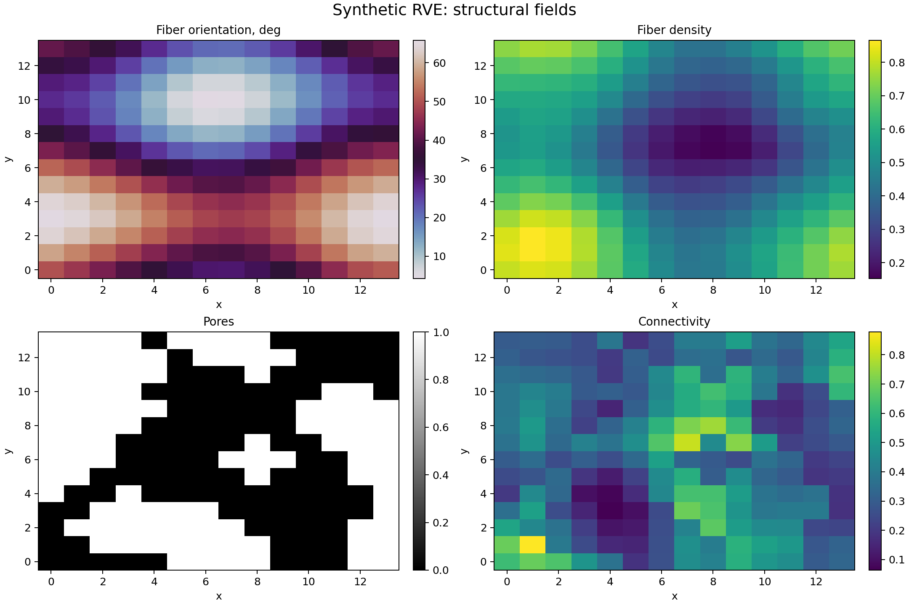
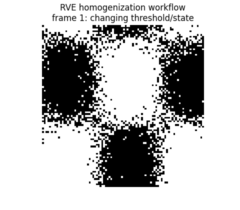
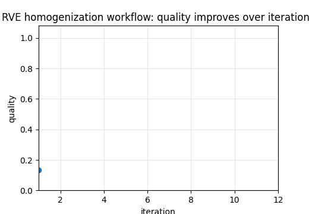

# Tutorial 22 — RVE Homogenization

[English](README.md) | [Русский](README.ru.md)

**Main question:** How does a heterogeneous fiber network become an effective stiffness tensor?

This tutorial is part of **Biomechanics Research Tutorials**.  It is a synthetic, reproducible teaching module: the data are generated by code, the figures are regenerated by `reproduce.py`, and the assumptions are stated explicitly.

## What this tutorial builds

- synthetic RVE with fibre orientation, density, pores and connectivity;
- local anisotropic plane-stress material law;
- Voigt and Reuss bounds;
- periodic displacement-fluctuation boundary conditions;
- effective stiffness tensor and directional modulus;

## What is measured

- Hill-Mandel consistency;
- effective stiffness entries;
- anisotropy ratio;
- directional Young modulus;
- RVE/mesh convergence;

## Why it matters

The tutorial explains how heterogeneous microstructure becomes an effective material point without hiding the role of boundary conditions and energy consistency.

## Visual outputs







Russian visual counterparts are available in [README.ru.md](README.ru.md).

## Run

From the repository root:

```bash
python tutorials/22-rve-homogenization/reproduce.py
pytest tutorials/22-rve-homogenization/tests -q
```

## Files

- `reproduce.py` regenerates data, tables, figures and animations.
- `chapters/` contains the English lesson chapters.
- `chapters/ru/` contains the Russian lesson chapters.
- `notebooks/` contains English and Russian notebooks.
- `figures/` contains static visualizations.
- `animations/` contains GIF animations, including localized Russian pairs when labels are present.
- `data/` contains synthetic arrays and benchmark tables.
- `tests/` contains compact correctness checks.

## Interpretation rule

The module is verification-ready, not experimental validation.  The correct interpretation is: *given known synthetic truth, can this computational step recover the quantity it is supposed to recover, and how does the error affect the next biomechanical step?*
