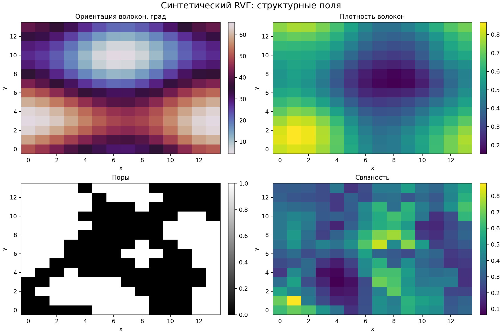
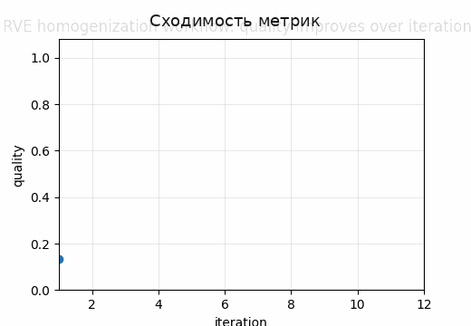
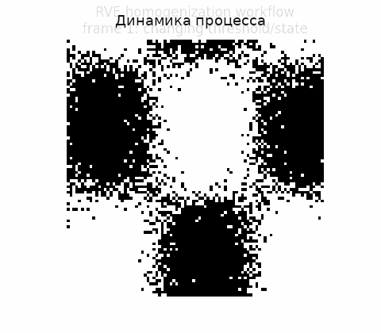

# Tutorial 22 — RVE-гомогенизация

[English](README.md) | [Русский](README.ru.md)

**Главный вопрос:** Как неоднородная волоконная сеть превращается в эффективный тензор жёсткости?

Этот tutorial входит в серию **Biomechanics Research Tutorials**.  Это синтетический и воспроизводимый учебный модуль: данные создаются кодом, рисунки пересоздаются через `reproduce.py`, а допущения явно описаны в главах.

## Что строится в этом tutorial

- синтетический RVE с ориентацией волокон, плотностью, порами и connectivity;
- локальный anisotropic plane-stress material law;
- Voigt и Reuss bounds;
- periodic displacement-fluctuation boundary conditions;
- effective stiffness tensor и directional modulus;

## Что измеряется

- Hill-Mandel consistency;
- компоненты effective stiffness;
- anisotropy ratio;
- directional Young modulus;
- RVE/mesh convergence;

## Почему это важно

Модуль объясняет, как неоднородная микроструктура превращается в эффективную material point-модель, не скрывая роль boundary conditions и energy consistency.

## Визуальные результаты







Английские визуальные версии доступны в [README.md](README.md).

## Запуск

Из корня репозитория:

```bash
python tutorials/22-rve-homogenization/reproduce.py
pytest tutorials/22-rve-homogenization/tests -q
```

## Файлы

- `reproduce.py` пересоздаёт данные, таблицы, рисунки и анимации.
- `chapters/` содержит английские главы.
- `chapters/ru/` содержит русские главы.
- `notebooks/` содержит английский и русский notebook.
- `figures/` содержит статичные визуализации.
- `animations/` содержит GIF-анимации, включая русские локализованные пары, если в анимации есть поясняющие подписи.
- `data/` содержит синтетические массивы и benchmark-таблицы.
- `tests/` содержит компактные проверки корректности.

## Правило интерпретации

Модуль является verification-ready, но не экспериментальной валидацией.  Правильная трактовка такая: *если синтетическая истина известна, может ли этот вычислительный этап восстановить нужную величину, и как ошибка влияет на следующий биомеханический шаг?*
