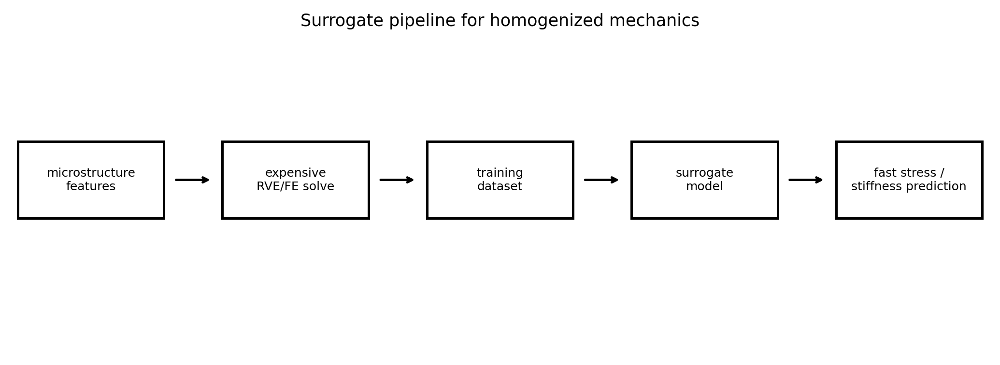
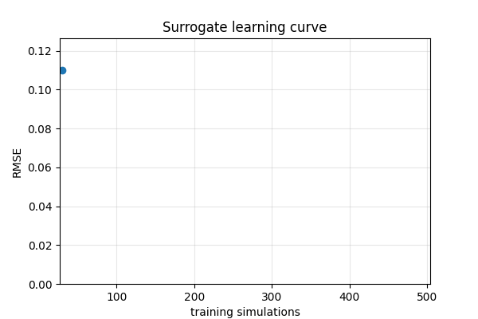
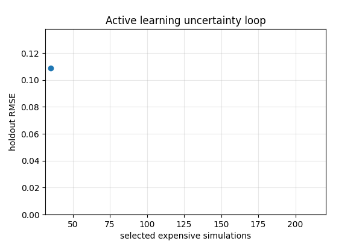

# Tutorial 23 — Surrogate Modeling for Homogenized Tissue Mechanics

[English](README.md) | [Русский](README.ru.md)

**Main question:** How can expensive RVE/FE simulations be replaced by tested, mechanics-aware surrogate models?

This tutorial is part of **Biomechanics Research Tutorials**.  It is a synthetic, reproducible teaching module: the data are generated by code, the figures are regenerated by `reproduce.py`, and the assumptions are stated explicitly.

## What this tutorial builds

- synthetic structure-to-stiffness training set;
- linear, quadratic and random-feature surrogates;
- multi-output stress and stiffness prediction;
- bootstrap ensemble uncertainty;
- active-learning loop and extrapolation diagnostics;

## What is measured

- test error;
- parity residuals;
- learning-curve slope;
- uncertainty/error correlation;
- active-learning improvement;

## Why it matters

The module teaches when a fast surrogate can replace an expensive RVE/FE solve and when it becomes unsafe outside the training design.

## Visual outputs







Russian visual counterparts are available in [README.ru.md](README.ru.md).

## Run

From the repository root:

```bash
python tutorials/23-surrogate-modeling-homogenized-tissue-mechanics/reproduce.py
pytest tutorials/23-surrogate-modeling-homogenized-tissue-mechanics/tests -q
```

## Files

- `reproduce.py` regenerates data, tables, figures and animations.
- `chapters/` contains the English lesson chapters.
- `chapters/ru/` contains the Russian lesson chapters.
- `notebooks/` contains English and Russian notebooks.
- `figures/` contains static visualizations.
- `animations/` contains GIF animations, including localized Russian pairs when labels are present.
- `data/` contains synthetic arrays and benchmark tables.
- `tests/` contains compact correctness checks.

## Interpretation rule

The module is verification-ready, not experimental validation.  The correct interpretation is: *given known synthetic truth, can this computational step recover the quantity it is supposed to recover, and how does the error affect the next biomechanical step?*
