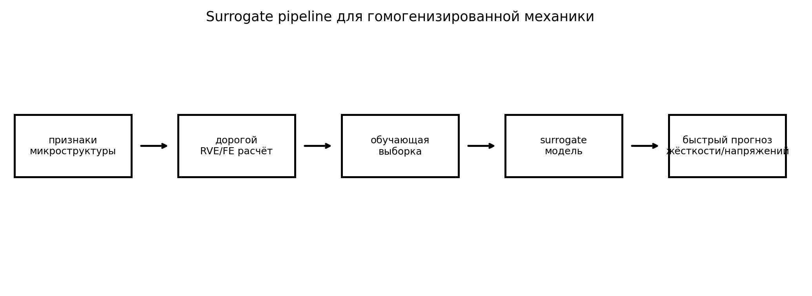
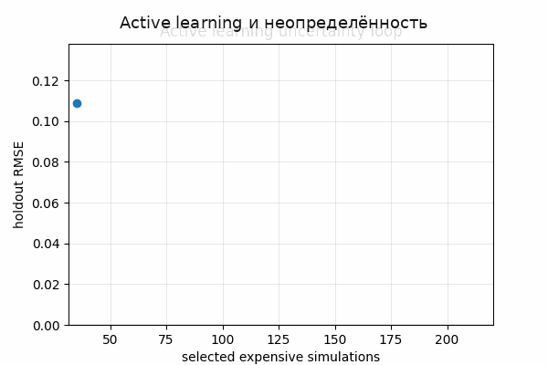
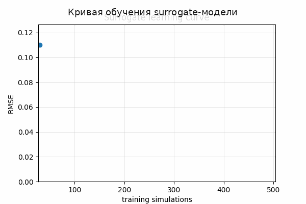

# Tutorial 23 — Surrogate-моделирование для гомогенизированной механики ткани

[English](README.md) | [Русский](README.ru.md)

**Главный вопрос:** Как заменить дорогие RVE/FE расчёты проверенными mechanics-aware surrogate-моделями?

Этот tutorial входит в серию **Biomechanics Research Tutorials**.  Это синтетический и воспроизводимый учебный модуль: данные создаются кодом, рисунки пересоздаются через `reproduce.py`, а допущения явно описаны в главах.

## Что строится в этом tutorial

- синтетический structure-to-stiffness training set;
- linear, quadratic и random-feature surrogates;
- multi-output предсказание stress и stiffness;
- bootstrap ensemble uncertainty;
- active-learning loop и extrapolation diagnostics;

## Что измеряется

- test error;
- parity residuals;
- learning-curve slope;
- uncertainty/error correlation;
- active-learning improvement;

## Почему это важно

Модуль показывает, когда быстрый surrogate может заменить дорогой RVE/FE расчёт, а когда становится опасным за пределами training design.

## Визуальные результаты







Английские визуальные версии доступны в [README.md](README.md).

## Запуск

Из корня репозитория:

```bash
python tutorials/23-surrogate-modeling-homogenized-tissue-mechanics/reproduce.py
pytest tutorials/23-surrogate-modeling-homogenized-tissue-mechanics/tests -q
```

## Файлы

- `reproduce.py` пересоздаёт данные, таблицы, рисунки и анимации.
- `chapters/` содержит английские главы.
- `chapters/ru/` содержит русские главы.
- `notebooks/` содержит английский и русский notebook.
- `figures/` содержит статичные визуализации.
- `animations/` содержит GIF-анимации, включая русские локализованные пары, если в анимации есть поясняющие подписи.
- `data/` содержит синтетические массивы и benchmark-таблицы.
- `tests/` содержит компактные проверки корректности.

## Правило интерпретации

Модуль является verification-ready, но не экспериментальной валидацией.  Правильная трактовка такая: *если синтетическая истина известна, может ли этот вычислительный этап восстановить нужную величину, и как ошибка влияет на следующий биомеханический шаг?*
