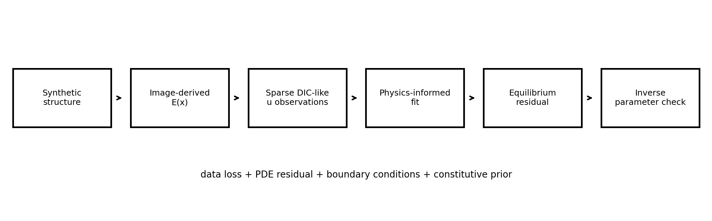
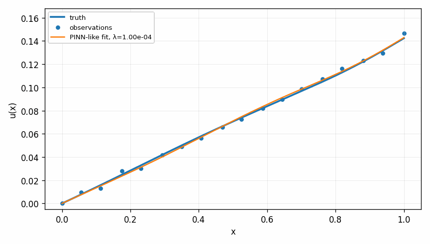
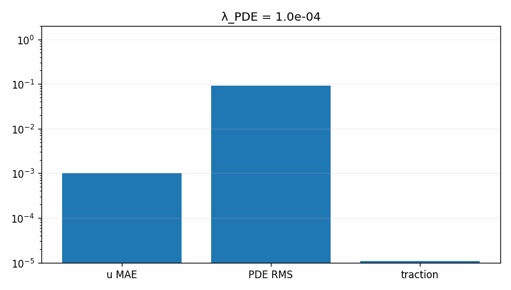

# Tutorial 24 — Physics-Informed Learning for Soft-Tissue Mechanics

[English](README.md) | [Русский](README.ru.md)

**Main question:** How can sparse data, boundary conditions and equilibrium residuals be combined in a transparent PINN-like benchmark?

This tutorial is part of **Biomechanics Research Tutorials**.  It is a synthetic, reproducible teaching module: the data are generated by code, the figures are regenerated by `reproduce.py`, and the assumptions are stated explicitly.

## What this tutorial builds

- synthetic heterogeneous soft-tissue bar;
- image-derived stiffness field;
- sparse DIC-like displacement observations;
- random-feature physics-informed least-squares model;
- PDE, displacement boundary and traction residual rows;

## What is measured

- displacement error;
- strain and stress errors;
- PDE residual RMS;
- traction error;
- physics-weight sweep and inverse stiffness-scale landscape;

## Why it matters

The tutorial makes physics-informed learning inspectable: data, boundary conditions and equilibrium residuals are visible rows in one linear system.

## Visual outputs







Russian visual counterparts are available in [README.ru.md](README.ru.md).

## Run

From the repository root:

```bash
python tutorials/24-physics-informed-learning-soft-tissue-mechanics/reproduce.py
pytest tutorials/24-physics-informed-learning-soft-tissue-mechanics/tests -q
```

## Files

- `reproduce.py` regenerates data, tables, figures and animations.
- `chapters/` contains the English lesson chapters.
- `chapters/ru/` contains the Russian lesson chapters.
- `notebooks/` contains English and Russian notebooks.
- `figures/` contains static visualizations.
- `animations/` contains GIF animations, including localized Russian pairs when labels are present.
- `data/` contains synthetic arrays and benchmark tables.
- `tests/` contains compact correctness checks.

## Interpretation rule

The module is verification-ready, not experimental validation.  The correct interpretation is: *given known synthetic truth, can this computational step recover the quantity it is supposed to recover, and how does the error affect the next biomechanical step?*
