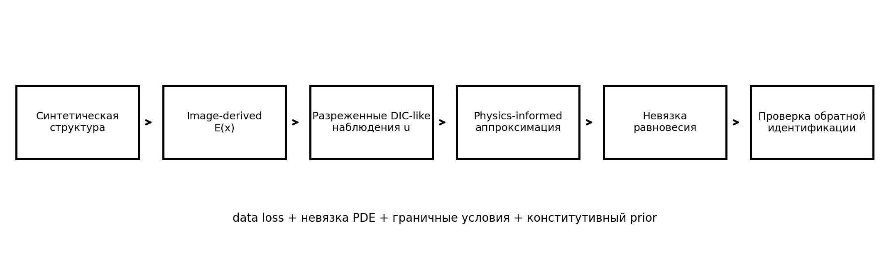
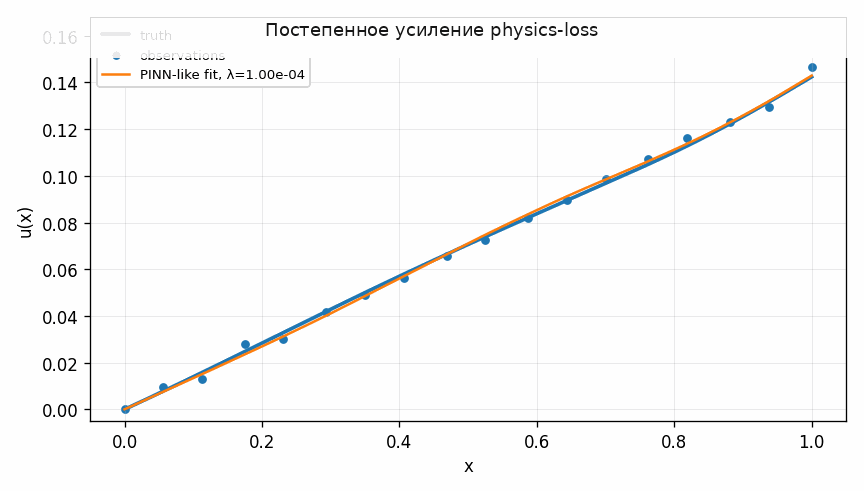
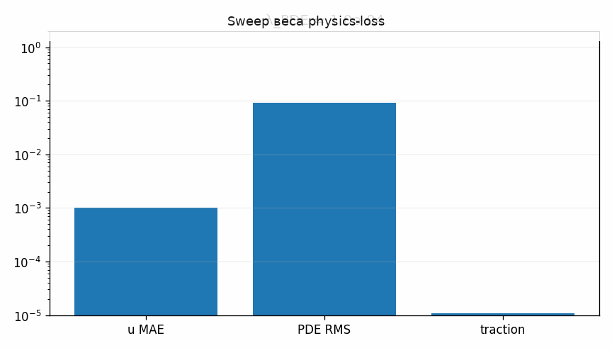

# Tutorial 24 — Physics-informed обучение для механики мягких тканей

[English](README.md) | [Русский](README.ru.md)

**Главный вопрос:** Как объединить разреженные данные, boundary conditions и невязку равновесия в прозрачном PINN-like benchmark?

Этот tutorial входит в серию **Biomechanics Research Tutorials**.  Это синтетический и воспроизводимый учебный модуль: данные создаются кодом, рисунки пересоздаются через `reproduce.py`, а допущения явно описаны в главах.

## Что строится в этом tutorial

- синтетический неоднородный soft-tissue bar;
- image-derived stiffness field;
- разреженные DIC-like displacement observations;
- random-feature physics-informed least-squares model;
- строки PDE, displacement boundary и traction residual;

## Что измеряется

- ошибка перемещений;
- ошибки strain и stress;
- PDE residual RMS;
- traction error;
- physics-weight sweep и inverse stiffness-scale landscape;

## Почему это важно

Модуль делает physics-informed learning прозрачным: data, boundary conditions и equilibrium residuals становятся видимыми строками одной линейной системы.

## Визуальные результаты







Английские визуальные версии доступны в [README.md](README.md).

## Запуск

Из корня репозитория:

```bash
python tutorials/24-physics-informed-learning-soft-tissue-mechanics/reproduce.py
pytest tutorials/24-physics-informed-learning-soft-tissue-mechanics/tests -q
```

## Файлы

- `reproduce.py` пересоздаёт данные, таблицы, рисунки и анимации.
- `chapters/` содержит английские главы.
- `chapters/ru/` содержит русские главы.
- `notebooks/` содержит английский и русский notebook.
- `figures/` содержит статичные визуализации.
- `animations/` содержит GIF-анимации, включая русские локализованные пары, если в анимации есть поясняющие подписи.
- `data/` содержит синтетические массивы и benchmark-таблицы.
- `tests/` содержит компактные проверки корректности.

## Правило интерпретации

Модуль является verification-ready, но не экспериментальной валидацией.  Правильная трактовка такая: *если синтетическая истина известна, может ли этот вычислительный этап восстановить нужную величину, и как ошибка влияет на следующий биомеханический шаг?*
