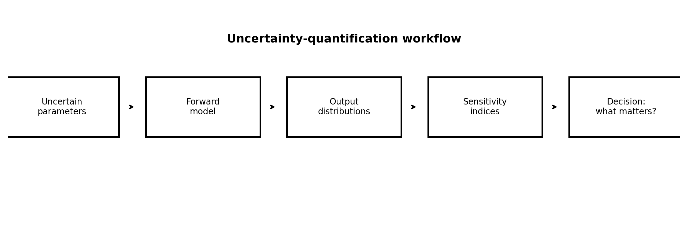
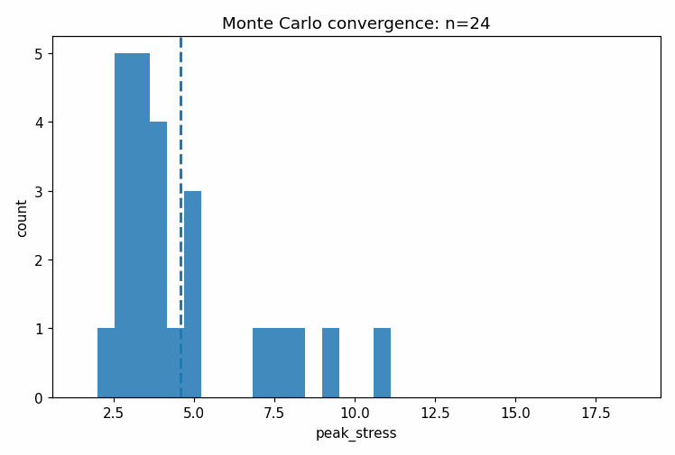
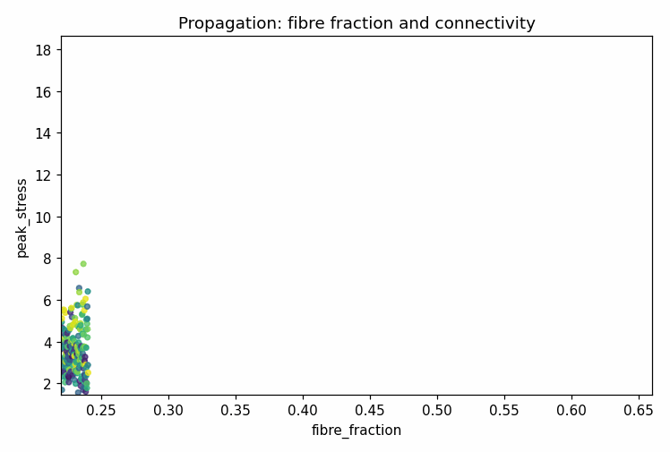

# Tutorial 25 — Sensitivity Analysis and Uncertainty Quantification

[English](README.md) | [Русский](README.ru.md)

**Main question:** Which uncertain inputs actually control predicted stiffness, stress, energy and reliability?

This tutorial is part of **Biomechanics Research Tutorials**.  It is a synthetic, reproducible teaching module: the data are generated by code, the figures are regenerated by `reproduce.py`, and the assumptions are stated explicitly.

## What this tutorial builds

- bounded structural, material, loading and boundary-condition parameter ranges;
- Latin hypercube Monte Carlo propagation;
- Sobol and Morris sensitivity analysis;
- tornado and reliability analysis;
- likelihood-based posterior update;

## What is measured

- output quantiles;
- Sobol first-order and total indices;
- Morris means and spreads;
- probability of exceeding limits;
- prior/posterior interval shrinkage;

## Why it matters

The final tutorial distinguishes visually precise model outputs from robust conclusions that remain credible under uncertain inputs.

## Visual outputs







Russian visual counterparts are available in [README.ru.md](README.ru.md).

## Run

From the repository root:

```bash
python tutorials/25-sensitivity-analysis-uncertainty-quantification/reproduce.py
pytest tutorials/25-sensitivity-analysis-uncertainty-quantification/tests -q
```

## Files

- `reproduce.py` regenerates data, tables, figures and animations.
- `chapters/` contains the English lesson chapters.
- `chapters/ru/` contains the Russian lesson chapters.
- `notebooks/` contains English and Russian notebooks.
- `figures/` contains static visualizations.
- `animations/` contains GIF animations, including localized Russian pairs when labels are present.
- `data/` contains synthetic arrays and benchmark tables.
- `tests/` contains compact correctness checks.

## Interpretation rule

The module is verification-ready, not experimental validation.  The correct interpretation is: *given known synthetic truth, can this computational step recover the quantity it is supposed to recover, and how does the error affect the next biomechanical step?*
