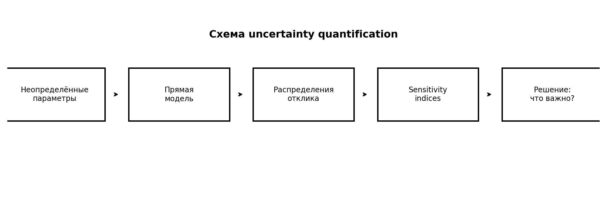
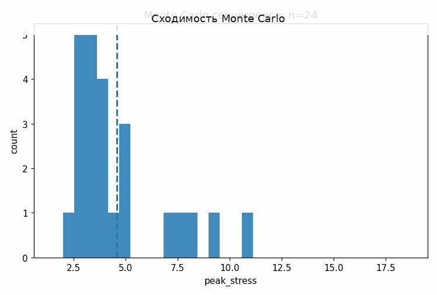
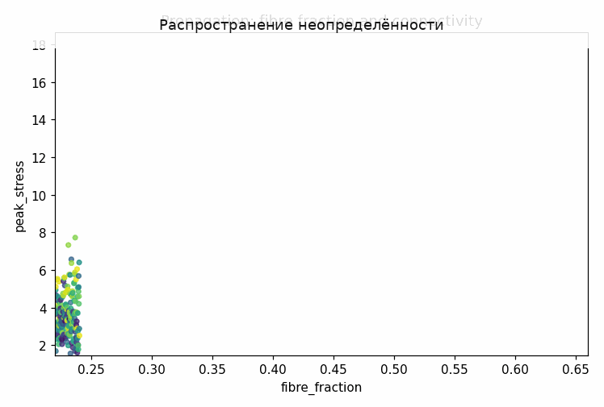

# Tutorial 25 — Анализ чувствительности и квантификация неопределённости

[English](README.md) | [Русский](README.ru.md)

**Главный вопрос:** Какие неопределённые входы реально управляют жёсткостью, напряжениями, энергией и reliability?

Этот tutorial входит в серию **Biomechanics Research Tutorials**.  Это синтетический и воспроизводимый учебный модуль: данные создаются кодом, рисунки пересоздаются через `reproduce.py`, а допущения явно описаны в главах.

## Что строится в этом tutorial

- bounded ranges для structural, material, loading и boundary-condition parameters;
- Latin hypercube Monte Carlo propagation;
- Sobol и Morris sensitivity analysis;
- tornado и reliability analysis;
- likelihood-based posterior update;

## Что измеряется

- output quantiles;
- Sobol first-order и total indices;
- Morris means and spreads;
- probability of exceeding limits;
- сужение prior/posterior intervals;

## Почему это важно

Финальный модуль отделяет визуально точные модельные поля от устойчивых выводов, которые сохраняются при неопределённых входных данных.

## Визуальные результаты







Английские визуальные версии доступны в [README.md](README.md).

## Запуск

Из корня репозитория:

```bash
python tutorials/25-sensitivity-analysis-uncertainty-quantification/reproduce.py
pytest tutorials/25-sensitivity-analysis-uncertainty-quantification/tests -q
```

## Файлы

- `reproduce.py` пересоздаёт данные, таблицы, рисунки и анимации.
- `chapters/` содержит английские главы.
- `chapters/ru/` содержит русские главы.
- `notebooks/` содержит английский и русский notebook.
- `figures/` содержит статичные визуализации.
- `animations/` содержит GIF-анимации, включая русские локализованные пары, если в анимации есть поясняющие подписи.
- `data/` содержит синтетические массивы и benchmark-таблицы.
- `tests/` содержит компактные проверки корректности.

## Правило интерпретации

Модуль является verification-ready, но не экспериментальной валидацией.  Правильная трактовка такая: *если синтетическая истина известна, может ли этот вычислительный этап восстановить нужную величину, и как ошибка влияет на следующий биомеханический шаг?*
